# Diagramas de Secuencia del Sistema AguaTacna

Este documento consolida la arquitectura y los **diagramas de secuencia completos** de la aplicación **AguaTacna** (Compose Multiplatform: Android & iOS). Cada módulo está desglosado en sus casos de uso y funciones principales, modelados mediante especificación **Mermaid** y alineados con la arquitectura Clean Architecture, flujo MVI/MVVM reactivo (Coroutines & Flows), Room como única fuente de verdad local (*Single Source of Truth*) y sincronización offline-first con Supabase / n8n.

---

## Tabla de Contenidos

1. [Convenciones de Arquitectura y Actores](#convenciones-de-arquitectura-y-actores)
2. [Módulo 1: Sesión, Onboarding y Bienvenida](#modulo-1-sesion-onboarding-y-bienvenida)
   - [1.1 Verificación de Estado de Sesión y Onboarding (`PuertaDeAcceso`)](#11-verificacion-de-estado-de-sesion-y-onboarding-puertadeacceso)
   - [1.2 Inicio de Sesión Anónimo (`Empezar sin cuenta`)](#12-inicio-de-sesion-anonimo-empezar-sin-cuenta)
   - [1.3 Inicio de Sesión con Google (`InicioConGoogle`)](#13-inicio-de-sesion-con-google-iniciocongoogle)
3. [Módulo 2: Reserva (Gestión Hídrica del Hogar)](#modulo-2-reserva-gestion-hidrica-del-hogar)
   - [2.1 Configuración Inicial del Hogar (`ConfiguracionViewModel`)](#21-configuracion-inicial-del-hogar-configuracionviewmodel)
   - [2.2 Registro de Evento de Llenado (Real vs Confirmación de Asumido)](#22-registro-de-evento-de-llenado-real-vs-confirmacion-de-asumido)
   - [2.3 Monitoreo Reactivo y Proyección Continua de Agotamiento](#23-monitoreo-reactivo-y-proyeccion-continua-de-agotamiento)
   - [2.4 Declaración de Agotamiento Real (`Me quedé sin agua`) y Recalibración](#24-declaracion-de-agotamiento-real-me-quede-sin-agua-y-recalibracion)
   - [2.5 Simulación y Sugerencia de Recortes de Consumo (`¿Qué recortar?`)](#25-simulacion-y-sugerencia-de-recortes-de-consumo-que-recortar)
   - [2.6 Tarea Periódica de Recálculo y Emisión de Avisos Preventivos (Worker)](#26-tarea-periodica-de-recalculo-y-emision-de-avisos-preventivos-worker)
   - [2.7 Sincronización en la Nube con Supabase (`SincronizadorReserva`)](#27-sincronizacion-en-la-nube-con-supabase-sincronizadorreserva)
4. [Módulo 3: Sector y Abastecimiento (Horarios y Cisternas)](#modulo-3-sector-y-abastecimiento-horarios-y-cisternas)
   - [3.1 Detección Espacial y Registro de Domicilio / Sector](#31-deteccion-espacial-y-registro-de-domicilio--sector)
   - [3.2 Consulta de Cronograma Vigente y Próximo Abastecimiento](#32-consulta-de-cronograma-vigente-y-proximo-abastecimiento)
   - [3.3 Confirmación Colaborativa Comunitaria (Llegada / Corte de Agua)](#33-confirmacion-colaborativa-comunitaria-llegada--corte-de-agua)
   - [3.4 Consolidación Algorítmica de Cronograma Colaborativo por Mediana](#34-consolidacion-algoritmica-de-cronograma-colaborativo-por-mediana)
   - [3.5 Búsqueda y Localización Espacial de Puntos de Cisterna](#35-busqueda-y-localizacion-espacial-de-puntos-de-cisterna)
   - [3.6 Sincronización Remota de Sectores y Cronogramas con Supabase](#36-sincronizacion-remota-de-sectores-y-cronogramas-con-supabase)
5. [Módulo 4: Recibo y Digitalización (OCR y Facturación EPS Tacna)](#modulo-4-recibo-y-digitalizacion-ocr-y-facturacion-eps-tacna)
   - [4.1 Captura Fotográfica y Procesamiento OCR de Recibo Físico](#41-captura-fotografica-y-procesamiento-ocr-de-recibo-fisico)
   - [4.2 Revisión Asistida y Corrección de Campos del Borrador](#42-revision-asistida-y-correccion-de-campos-del-borrador)
   - [4.3 Confirmación, Validación Estricta y Guardado del Recibo](#43-confirmacion-validacion-estricta-y-guardado-del-recibo)
   - [4.4 Registro Manual de Lectura de Medidor Cúbico](#44-registro-manual-de-lectura-de-medidor-cubico)
   - [4.5 Consulta Histórica de Consumo y Detección de Consumo Atípico](#45-consulta-historica-de-consumo-y-deteccion-de-consumo-atipico)
   - [4.6 Sincronización Bidireccional de Recibos con Supabase](#46-sincronizacion-bidireccional-de-recibos-con-supabase)
6. [Módulo 5: Asistente Hídrico Inteligente (n8n & IA)](#modulo-5-asistente-hidrico-inteligente-n8n--ia)
   - [5.1 Envío de Pregunta Ciudadana y Consulta a Webhook n8n](#51-envio-de-pregunta-ciudadana-y-consulta-a-webhook-n8n)
   - [5.2 Observación Reactiva de Conversación y Estados de Escribiendo](#52-observacion-reactiva-de-conversacion-y-estados-de-escribiendo)
   - [5.3 Limpieza y Reinicio de la Conversación](#53-limpieza-y-reinicio-de-la-conversacion)
7. [Módulo 6: Retos y Reportes Ciudadanos (Gamificación y Comunidad)](#modulo-6-retos-y-reportes-ciudadanos-gamificacion-y-comunidad)
   - [7.1 Consulta de Retos Semanales y Posición Relativa en el Sector](#71-consulta-de-retos-semanales-y-posicion-relativa-en-el-sector)
   - [7.2 Marcado de Reto Cumplido y Recálculo de Racha](#72-marcado-de-reto-cumplido-y-recalculo-de-racha)
   - [7.3 Generación y Registro de Reporte Ciudadano con Evidencia Fotográfica](#73-generacion-y-registro-de-reporte-ciudadano-con-evidencia-fotografica)
   - [7.4 Exploración de Incidencias en el Mapa Comunitario](#74-exploracion-de-incidencias-en-el-mapa-comunitario)

---

## Convenciones de Arquitectura y Actores

Los diagramas emplean las siguientes convenciones de participantes:
- **`Usuario`**: Persona interactuando con la interfaz táctil.
- **`UI (Screen / Composable)`**: Pantalla o componente en Jetpack / Compose Multiplatform.
- **`ViewModel`**: Gestor de estado de presentación (`StateFlow`), escucha eventos (`Intent`) y emite `UiState`.
- **`UseCase`**: Clase de lógica de negocio pura en `domain/usecase/`.
- **`Repository`**: Contrato de datos en `domain/repository/` e implementación en `data/`.
- **`DAO / Store`**: Objeto de acceso a datos Room SQLite local (`data/local/`) o almacén en memoria.
- **`Remote / Cloud`**: APIs externas, clientes HTTP Ktor (`Supabase`, `n8n webhook`, Google Auth).
- **`Platform / Hardware`**: Sensores de la plataforma (Cámara, GPS, Sistema de Archivos, WorkManager).

---

## Módulo 1: Sesión, Onboarding y Bienvenida

Custodio transversal del acceso, persistencia del modo de uso (anónimo local vs Google) y comprobación de registro de domicilio inicial.

### 1.1 Verificación de Estado de Sesión y Onboarding (`PuertaDeAcceso`)

Determina la pantalla inicial al abrir la app: si ya inició sesión y configuró su domicilio, va directo al `NavHost` principal; en caso contrario, muestra la bienvenida o el registro de domicilio.

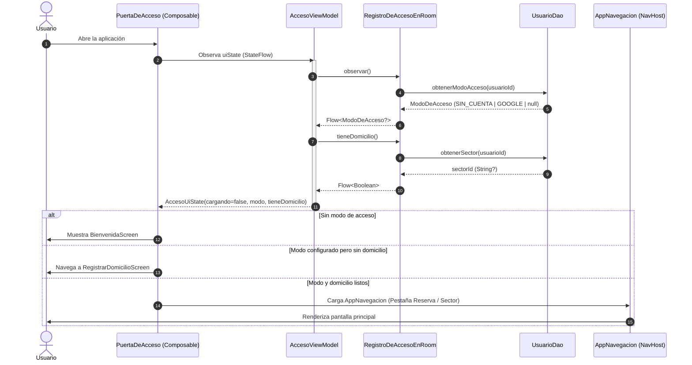

---

### 1.2 Inicio de Sesión Anónimo (`Empezar sin cuenta`)

Permite al ciudadano usar la aplicación de inmediato bajo privacidad total (almacenamiento local en SQLite).

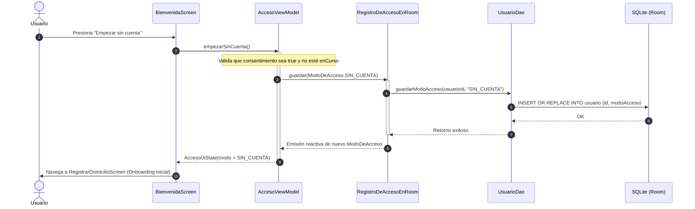

---

### 1.3 Inicio de Sesión con Google (`InicioConGoogle`)

Flujo federado de autenticación con credenciales Google para respaldar datos en la nube.

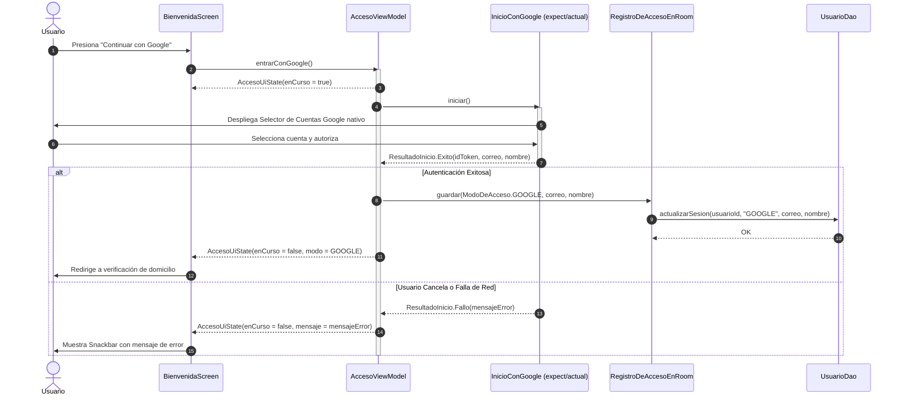

---

## Módulo 2: Reserva (Gestión Hídrica del Hogar)

Responsable: **Cristhian**. Modela el tanque/cisterna del hogar, calcula la tasa de agotamiento ($L/h$), proyecta la fecha/hora sin agua y emite alertas preventivas.

### 2.1 Configuración Inicial del Hogar (`ConfiguracionViewModel`)

Registro de las características físicas de almacenamiento y ocupantes de la vivienda.

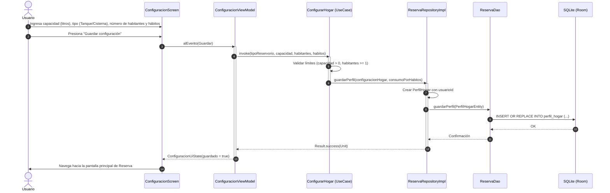

---

### 2.2 Registro de Evento de Llenado (Real vs Confirmación de Asumido)

Cuando la red pública abastece agua, el usuario registra el llenado o confirma el llenado automático estimado por el cronograma del sector.

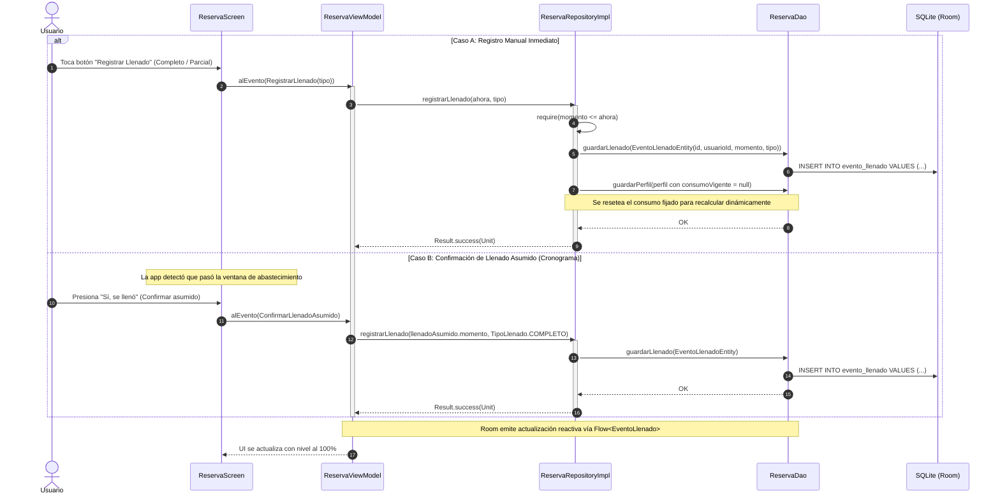

---

### 2.3 Monitoreo Reactivo y Proyección Continua de Agotamiento

Flujo principal de la pantalla de Reserva: orquesta el tiempo transcurrido, resta el consumo estimado por habitante/hora y calcula el déficit frente a la próxima llegada de agua.

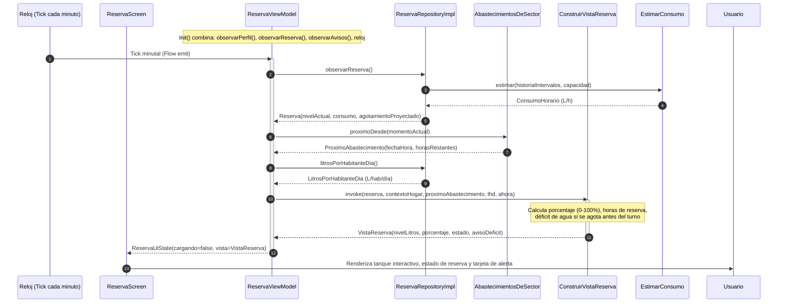

---

### 2.4 Declaración de Agotamiento Real (`Me quedé sin agua`) y Recalibración

Cuando el agua se acaba antes de lo proyectado, el usuario lo declara. El sistema recalibra la tasa de consumo horaria con un límite de cambio prudente (*anti-error de dedo*).

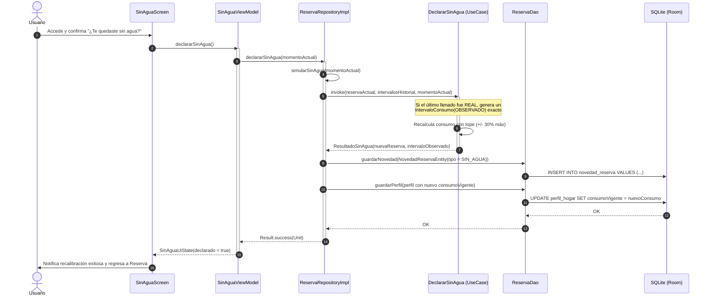

---

### 2.5 Simulación y Sugerencia de Recortes de Consumo (`¿Qué recortar?`)

Algoritmo heurístico que aconseja qué actividades reducir (duchas, lavado de ropa, riego) cuando la reserva no alcanzará hasta el próximo turno de agua.

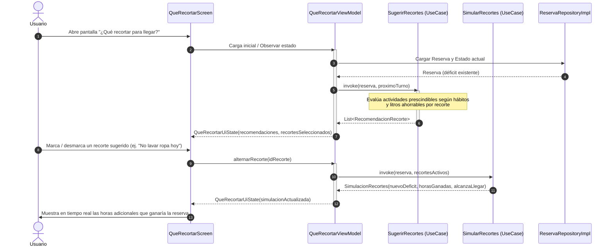

---

### 2.6 Tarea Periódica de Recálculo y Emisión de Avisos Preventivos (Worker)

Ejecución en segundo plano horaria (vía WorkManager en Android) para alertar al usuario antes de que se quede sin agua, sin necesidad de abrir la app.

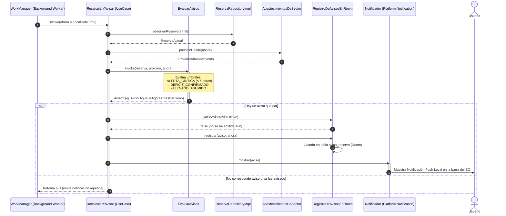

---

### 2.7 Sincronización en la Nube con Supabase (`SincronizadorReserva`)

Garantiza persistencia y respaldo en el backend cuando se detecta conexión a internet.

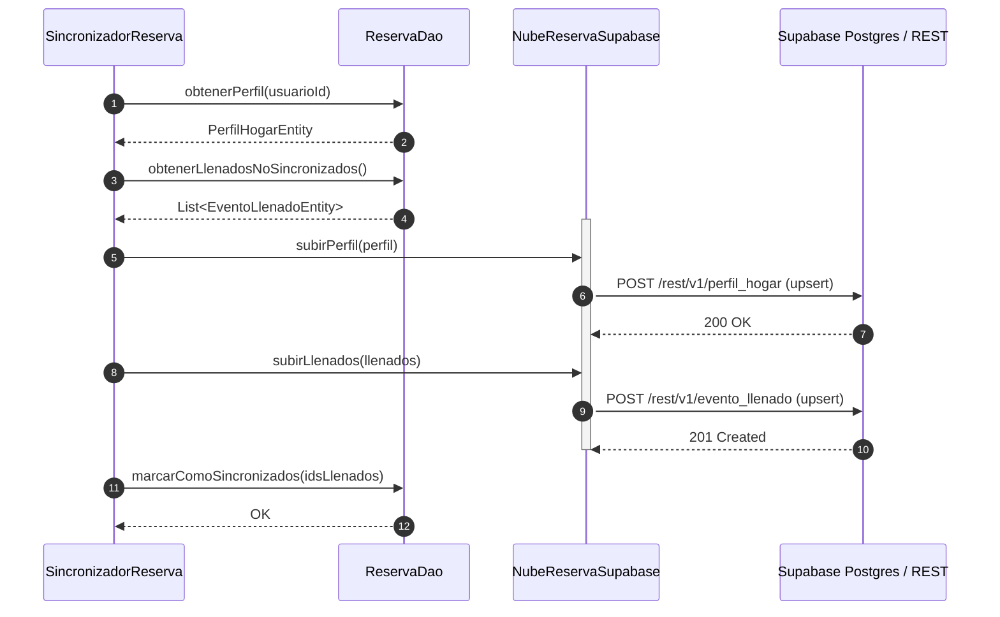

---

## Módulo 3: Sector y Abastecimiento (Horarios y Cisternas)

Responsable: **Dayan**. Administra los 14+ sectores operacionales de Tacna, cronogramas de tandeo, confirmaciones ciudadanas de horarios y red de cisternas.

### 3.1 Detección Espacial y Registro de Domicilio / Sector

El usuario ubica su domicilio vía GPS o pin en el mapa interactivo; el dominio calcula la pertenencia geográfica al sector.

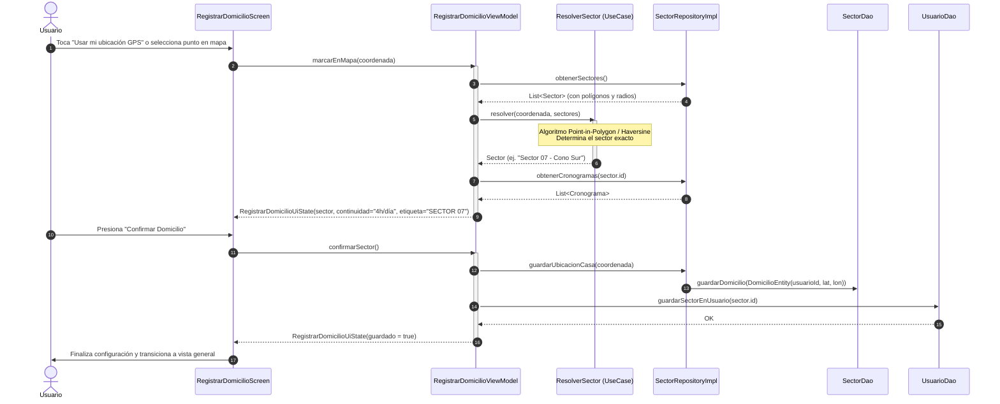

---

### 3.2 Consulta de Cronograma Vigente y Próximo Abastecimiento

Cálculo dinámico del estado del servicio de agua (¿hay agua en este momento? y ¿cuántas horas faltan para la próxima apertura?).

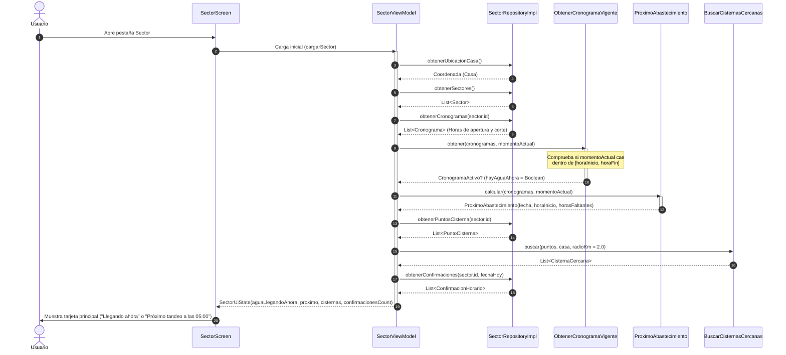

---

### 3.3 Confirmación Colaborativa Comunitaria (Llegada / Corte de Agua)

Los vecinos notifican en tiempo real la llegada o el corte físico del agua en su calle/sector.

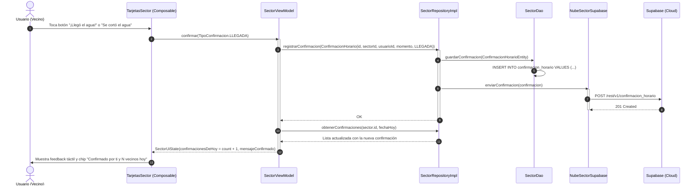

---

### 3.4 Consolidación Algorítmica de Cronograma Colaborativo por Mediana

Consolida los reportes comunitarios y filtra anomalías estadísticas mediante la mediana para ajustar la hora de corte real.

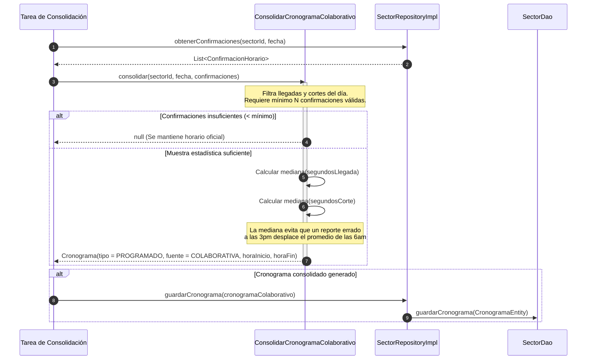

---

### 3.5 Búsqueda y Localización Espacial de Puntos de Cisterna

Muestra los puntos habilitados de reparto alternativo de agua mediante camiones cisterna de la EPS.

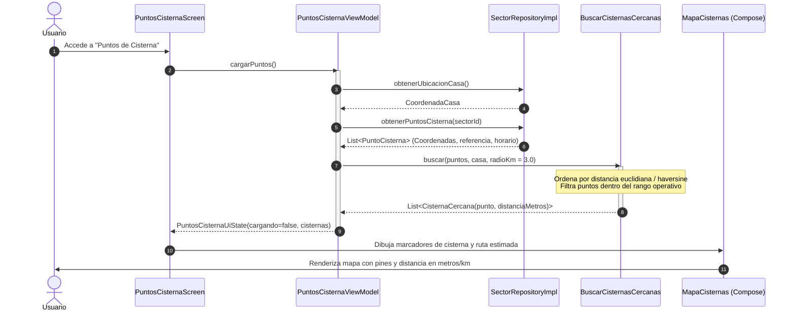

---

### 3.6 Sincronización Remota de Sectores y Cronogramas con Supabase

Descarga de las fuentes oficiales de EPS Tacna almacenadas en la base centralizada.

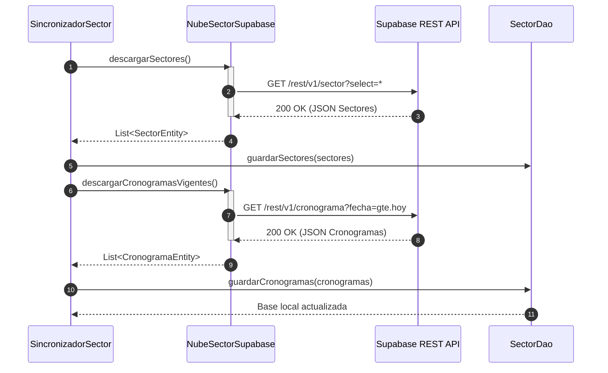

---

## Módulo 4: Recibo y Digitalización (OCR y Facturación EPS Tacna)

Responsable: **Iker**. Extrae datos de la boleta de agua física mediante OCR en el dispositivo, valida coherencia volumétrica y registra el historial de facturación.

### 4.1 Captura Fotográfica y Procesamiento OCR de Recibo Físico

Flujo desde que el usuario enfoca la boleta hasta la extracción estructurada de campos (período, consumo $m^3$, importe S/, lecturas).

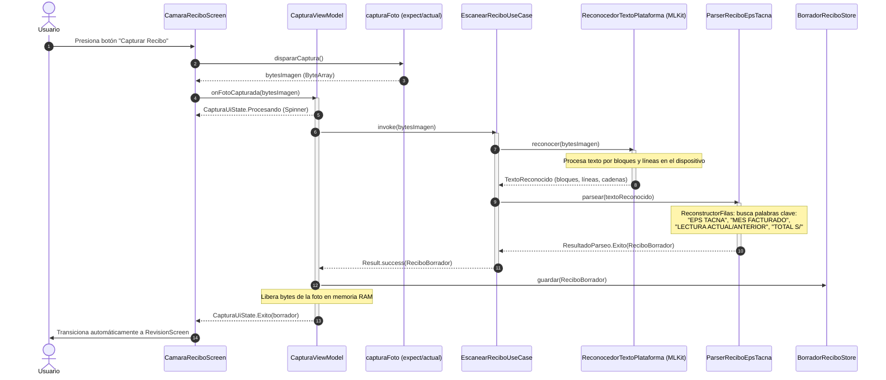

---

### 4.2 Revisión Asistida y Corrección de Campos del Borrador

Si un número fue interpretado con baja confianza (o borroso), el usuario lo edita antes de guardarlo.

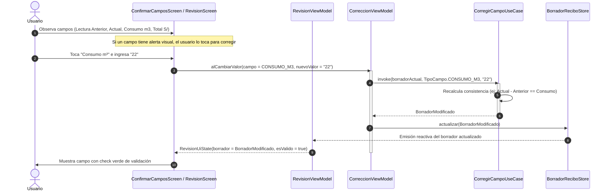

---

### 4.3 Confirmación, Validación Estricta y Guardado del Recibo

Persistencia en base de datos Room verificando que no existan duplicados para el mismo mes facturado.

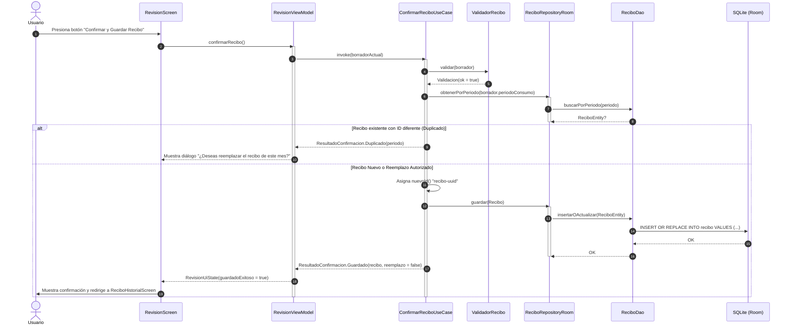

---

### 4.4 Registro Manual de Lectura de Medidor Cúbico

Alternativa a la foto: ingreso de los dígitos del dial del medidor hogareño para estimar el consumo intermedio.

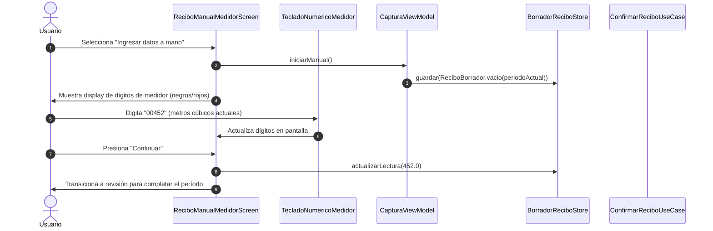

---

### 4.5 Consulta Histórica de Consumo y Detección de Consumo Atípico

Gráficos de barras de evolución mensual ($m^3$) y diagnóstico de posibles fugas no visibles.

```mermaid
sequenceDiagram
    autonumber
    actor Usuario
    participant UI as ReciboHistorialScreen
    participant VM as HistorialViewModel
    participant UC_Hist as ObservarHistorialUseCase
    participant UC_Resumen as ObservarResumenUseCase
    participant Eval as EvaluadorConsumo
    participant Repo as ReciboRepositoryRoom
    participant DAO as ReciboDao

    Usuario->>UI: Ingresa a "Historial de Recibos"
    UI->>VM: Observa estado del historial
    activate VM
    VM->>UC_Hist: invoke()
    activate UC_Hist
    UC_Hist->>Repo: observarRecibos()
    Repo->>DAO: obtenerTodosOrdenadosPorPeriodo()
    DAO-->>Repo: Flow<List<ReciboEntity>>
    Repo-->>UC_Hist: Flow<List<Recibo>>
    deactivate UC_Hist

    VM->>UC_Resumen: invoke()
    activate UC_Resumen
    UC_Resumen->>Eval: calcularPromedioHistorico(recibos)
    Eval-->>UC_Resumen: PromedioM3 (ej. 14.5 m3)
    UC_Resumen->>Eval: detectarConsumoAtipico(ultimoRecibo, promedio)
    activate Eval
    Note over Eval: Si ultimo.m3 > promedio * 1.5<br/>Marca bandera de consumo atípico / posible fuga
    Eval-->>UC_Resumen: ConsumoAtipico(esAtipico=true, porcentajeExceso=+60%)
    deactivate Eval
    UC_Resumen-->>VM: ResumenConsumo(promedio, atipico, tendencia)
    deactivate UC_Resumen

    VM-->>UI: HistorialUiState(recibos, resumen, alertaFugaVisible = true)
    deactivate VM
    UI->>Usuario: Dibuja gráfico de barras y banner de advertencia de fuga
```

---

### 4.6 Sincronización Bidireccional de Recibos con Supabase

Respaldo cifrado de las facturas históricas en el repositorio en la nube.

```mermaid
sequenceDiagram
    autonumber
    participant Sync as SincronizadorRecibo
    participant DAO as ReciboDao
    participant Nube as NubeReciboSupabase
    participant Supa as Supabase (PostgreSQL)

    Sync->>DAO: obtenerRecibosPendientesDeSubida()
    DAO-->>Sync: List<ReciboEntity>
    loop Por cada recibo no sincronizado
        Sync->>Nube: subirRecibo(recibo)
        activate Nube
        Nube->>Supa: POST /rest/v1/recibo (Upsert por id)
        Supa-->>Nube: 201 Created / 200 OK
        deactivate Nube
        Sync->>DAO: marcarSincronizado(recibo.id, true)
        DAO-->>Sync: OK
    end
```

---

## Módulo 5: Asistente Hídrico Inteligente (n8n & IA)

Integración conversacional para resolver dudas sobre normativas Sunass, lectura de recibos, reclamos por cortes imprevistos y técnicas de ahorro.

### 5.1 Envío de Pregunta Ciudadana y Consulta a Webhook n8n

Envío de consulta, mantenimiento de sesión conversacional y recepción de respuesta del agente IA.

```mermaid
sequenceDiagram
    autonumber
    actor Usuario
    participant UI as AsistenteScreen
    participant VM as AsistenteViewModel
    participant UC as EnviarMensajeUseCase
    participant Repo as AsistenteRepositoryImpl
    participant Client as N8nApiClient (Ktor)
    participant Webhook as Webhook n8n (Agente IA)

    Usuario->>UI: Escribe "¿Cómo puedo reclamar un cobro excesivo?" y presiona Enviar
    UI->>VM: enviarMensaje()
    activate VM
    VM->>VM: Limpia caja de texto y activa estaEscribiendo = true
    VM->>UC: invoke(textoLimpio)
    activate UC
    UC->>Repo: enviarMensaje(textoLimpio)
    activate Repo
    Repo->>Repo: Agrega mensaje de usuario al Flow local
    Repo-->>VM: Emisión inmediata (Burbuja usuario aparece en pantalla)

    Repo->>Client: enviarPregunta(texto, sessionId, timestamp)
    activate Client
    Client->>Webhook: POST /webhook/asistente-agua (JSON body con mensaje y session)
    activate Webhook
    Note over Webhook: Flujo n8n: Clasificación de intención,<br/>RAG con base de conocimiento EPS Tacna y respuesta
    Webhook-->>Client: 200 OK {"output": "Para reclamar un cobro excesivo debes..."}
    deactivate Webhook
    Client-->>Repo: String respuesta
    deactivate Client

    Repo->>Repo: Crea MensajeAsistente(esUsuario = false, texto = respuesta)
    Repo-->>UC: Result.success(MensajeAsistente)
    deactivate Repo
    UC-->>VM: Result.success
    deactivate UC
    VM->>VM: estaEscribiendo = false
    VM-->>UI: AsistenteUiState(mensajes, estaEscribiendo = false)
    deactivate VM
    UI->>Usuario: Despliega respuesta del asistente con animación de entrada
```

---

### 5.2 Observación Reactiva de Conversación y Estados de Escribiendo

Manejo del indicador de "pensando / escribiendo" y visualización reactiva de las burbujas de diálogo.

```mermaid
sequenceDiagram
    autonumber
    participant UI as AsistenteScreen
    participant VM as AsistenteViewModel
    participant UC_Obs as ObservarMensajesUseCase
    participant Repo as AsistenteRepositoryImpl
    participant Ind as IndicadorEscribiendo (Composable)

    UI->>VM: Recolecta uiState (StateFlow)
    activate VM
    VM->>UC_Obs: invoke()
    UC_Obs->>Repo: observarMensajes()
    Repo-->>VM: Flow<List<MensajeAsistente>>
    VM-->>UI: AsistenteUiState(mensajes, estaEscribiendo)
    deactivate VM

    alt estaEscribiendo == true
        UI->>Ind: Renderiza burbuja con animación de tres puntos suspensivos
    else estaEscribiendo == false
        UI->>Ind: Oculta indicador
    end
```

---

### 5.3 Limpieza y Reinicio de la Conversación

Permite al usuario vaciar el historial en memoria para iniciar una nueva consulta aislada.

```mermaid
sequenceDiagram
    autonumber
    actor Usuario
    participant UI as AsistenteScreen
    participant VM as AsistenteViewModel
    participant UC as LimpiarConversacionUseCase
    participant Repo as AsistenteRepositoryImpl

    Usuario->>UI: Toca icono de menú "Reiniciar conversación"
    UI->>VM: reiniciarConversacion()
    activate VM
    VM->>UC: invoke()
    activate UC
    UC->>Repo: limpiarConversacion()
    activate Repo
    Repo->>Repo: _mensajes.value = emptyList()
    deactivate Repo
    deactivate UC
    VM->>VM: Reset de variables (_textoEntrada, _estaEscribiendo = false)
    VM-->>UI: AsistenteUiState(mensajes = [])
    deactivate VM
    UI->>Usuario: Muestra pantalla de chat vacía con sugerencias de preguntas iniciales
```

---

## Módulo 6: Retos y Reportes Ciudadanos (Gamificación y Comunidad)

Responsable: **Jimmy**. Incentiva la cultura de ahorro hídrico (retos y rachas) y permite alertar fugas en vía pública a la comunidad.

### 6.1 Consulta de Retos Semanales y Posición Relativa en el Sector

Carga de las misiones semanales de ahorro y comparación del consumo personal contra el promedio barrial.

```mermaid
sequenceDiagram
    autonumber
    actor Usuario
    participant UI as RetosScreen
    participant VM as RetosViewModel
    participant UC_Retos as ObtenerRetosSemana
    participant UC_Comp as CompararConSector
    participant UC_Racha as CalcularRacha
    participant Repo as RetosRepository

    Usuario->>UI: Ingresa a pestaña "Comunidad y Retos"
    UI->>VM: Carga inicial (cargar())
    activate VM
    VM->>UC_Retos: ejecutar()
    activate UC_Retos
    UC_Retos->>Repo: obtenerRetosSemana()
    Repo-->>UC_Retos: List<Reto> (ej. "Duchas de 4 minutos", "Reusar agua de lavado")
    deactivate UC_Retos

    VM->>Repo: obtenerCumplimientos()
    Repo-->>VM: List<RetoUsuario>
    VM->>UC_Racha: calcular(cumplimientos, fechaActual)
    UC_Racha-->>VM: Racha (días consecutivos cumpliendo retos)

    VM->>UC_Comp: ejecutar(sectorId, consumoLhd)
    activate UC_Comp
    Note over UC_Comp: Compara consumo del hogar (92 L/hab/día)<br/>contra percentil del sector (ej. Top 15% más eficiente)
    UC_Comp-->>VM: PosicionSector (puesto, medalla)
    deactivate UC_Comp

    VM-->>UI: RetosUiState(retos, cumplidos, racha, posicionSector)
    deactivate VM
    UI->>Usuario: Despliega tarjetas de retos, insignia de racha y comparativa
```

---

### 6.2 Marcado de Reto Cumplido y Recálculo de Racha

El usuario reporta el cumplimiento de una acción de ahorro diario; el sistema actualiza su racha.

```mermaid
sequenceDiagram
    autonumber
    actor Usuario
    participant UI as RetosContenido (Composable)
    participant VM as RetosViewModel
    participant UC_Marcar as MarcarRetoCumplido
    participant UC_Racha as CalcularRacha
    participant Repo as RetosRepository
    participant DAO as RetosDao

    Usuario->>UI: Marca checkbox "Reto cumplido"
    UI->>VM: completar(retoId)
    activate VM
    VM->>UC_Marcar: ejecutar(retoId)
    activate UC_Marcar
    UC_Marcar->>Repo: marcarCumplido(retoId, fechaHoy)
    activate Repo
    Repo->>DAO: guardarRetoCumplido(RetoUsuarioEntity)
    DAO-->>Repo: OK
    deactivate Repo
    deactivate UC_Marcar

    VM->>Repo: obtenerCumplimientos()
    Repo-->>VM: Lista actualizada
    VM->>UC_Racha: calcular(cumplimientosActualizados, fechaHoy)
    UC_Racha-->>VM: Nueva Racha (+1 día)

    VM-->>UI: RetosUiState(cumplidos += retoId, racha, mensaje = "¡Reto cumplido!")
    deactivate VM
    UI->>Usuario: Muestra animación de confeti / medalla y actualiza contador de racha
```

---

### 6.3 Generación y Registro de Reporte Ciudadano con Evidencia Fotográfica

Reporte offline-first de fugas en la vía pública o cortes imprevistos con coordenadas y fotografía adjunta.

```mermaid
sequenceDiagram
    autonumber
    actor Usuario
    participant UI as ReportesScreen
    participant FotoUtil as rememberCapturaFoto
    participant FileKit as rememberFilePickerLauncher
    participant UC as CrearReporte
    participant Repo as ReporteRepository (Fake/Room)
    participant Cola as ColaSincronizacionOffline

    Usuario->>UI: Selecciona tipo de incidencia ("FUGA EN VÍA PÚBLICA")
    Usuario->>UI: Ingresa descripción textual ("Rotura de tubería en Av. Bolognesi")
    
    alt Opción 1: Tomar Fotografía
        Usuario->>UI: Presiona "Tomar fotografía"
        UI->>FotoUtil: tomarFoto()
        FotoUtil->>Usuario: Abre cámara del dispositivo
        Usuario->>FotoUtil: Captura foto y confirma
        FotoUtil-->>UI: fotoAdjunta = true
    else Opción 2: Adjuntar de Galería
        Usuario->>UI: Presiona "Adjuntar de galería"
        UI->>FileKit: launch()
        FileKit->>Usuario: Selector de imágenes del sistema
        Usuario->>FileKit: Elige foto
        FileKit-->>UI: fotoAdjunta = true
    end

    Usuario->>UI: Presiona "Enviar Reporte"
    UI->>UC: ejecutar(Reporte(id, tipo, descripcion, coordenada, foto, fecha))
    activate UC
    UC->>Repo: guardar(reporte)
    activate Repo
    Repo->>Repo: Persiste reporte en SQLite local
    Repo->>Cola: Encolar para envío a Supabase cuando haya red
    Repo-->>UC: OK
    deactivate Repo
    UC-->>UI: Exito
    deactivate UC
    UI->>Usuario: Mensaje "Reporte registrado. Se enviará al recuperar conexión."
```

---

### 6.4 Exploración de Incidencias en el Mapa Comunitario

Visualización georreferenciada de reportes generados por la comunidad vecinal.

```mermaid
sequenceDiagram
    autonumber
    actor Usuario
    participant UI as ComunidadScreen
    participant Mapa as MapaReportes (Composable)
    participant Repo as ReporteRepository

    Usuario->>UI: Selecciona pestaña "Mapa Comunitario"
    UI->>Mapa: Carga componente de mapa
    activate Mapa
    Mapa->>Repo: obtenerReportesActivos()
    Repo-->>Mapa: List<Reporte> (Coordenadas, TipoReporte, Timestamp)
    loop Por cada reporte
        Mapa->>Mapa: Dibuja marcador temático (Gota roja para fugas, Alerta para cortes)
    end
    deactivate Mapa
    Mapa->>Usuario: Despliega mapa interactivo con clústeres de incidencias
    Usuario->>Mapa: Toca un marcador
    Mapa->>Usuario: Despliega ficha resumen de la incidencia comunitaria
```

---

## Resumen de Interacciones entre Módulos

El siguiente diagrama de alto nivel muestra cómo los módulos se comunican a través de los contratos de dominio sin violar la separación arquitectónica:

```mermaid
sequenceDiagram
    autonumber
    participant Sector as Módulo Sector
    participant Reserva as Módulo Reserva
    participant Recibo as Módulo Recibo
    participant Retos as Módulo Retos
    participant Asistente as Módulo Asistente

    Note over Sector,Reserva: Interdependencia Crítica:<br/>Reserva necesita el próximo turno de agua para calcular déficit
    Reserva->>Sector: AbastecimientosDeSector.proximoDesde(ahora)
    Sector-->>Reserva: ProximoAbastecimiento(fechaHora, horas)

    Note over Recibo,Reserva: Calibración de Consumo:<br/>El consumo histórico del recibo refina la tasa de consumo del hogar
    Reserva->>Recibo: ReciboRepository.obtenerUltimoConsumoM3()
    Recibo-->>Reserva: ConsumoPromedioMes

    Note over Reserva,Retos: Gamificación con Datos Reales:<br/>Retos compara el ahorro efectivo generado en la reserva
    Retos->>Reserva: ReservaRepository.litrosPorHabitanteDia()
    Reserva-->>Retos: LitrosPorHabitanteDia (ej. 92 L/hab/día)

    Note over Asistente,Recibo: Asistencia Guiada:<br/>El asistente n8n responde dudas sobre cobros y lectura de la boleta
    Asistente->>Recibo: Contexto del último recibo digitalizado
