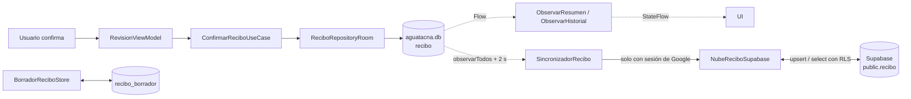
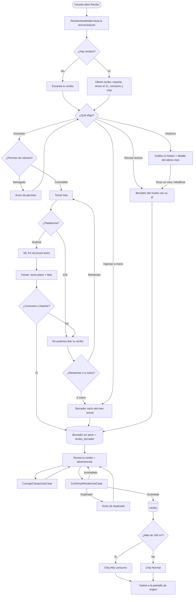
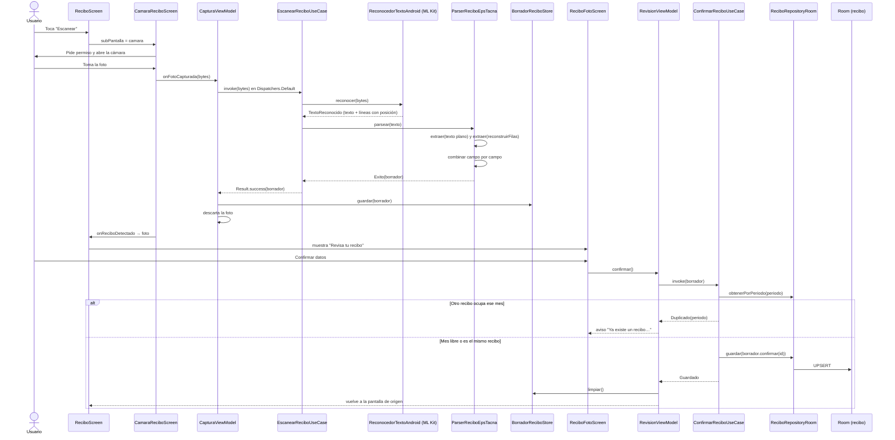
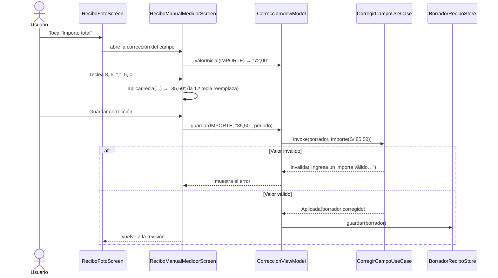
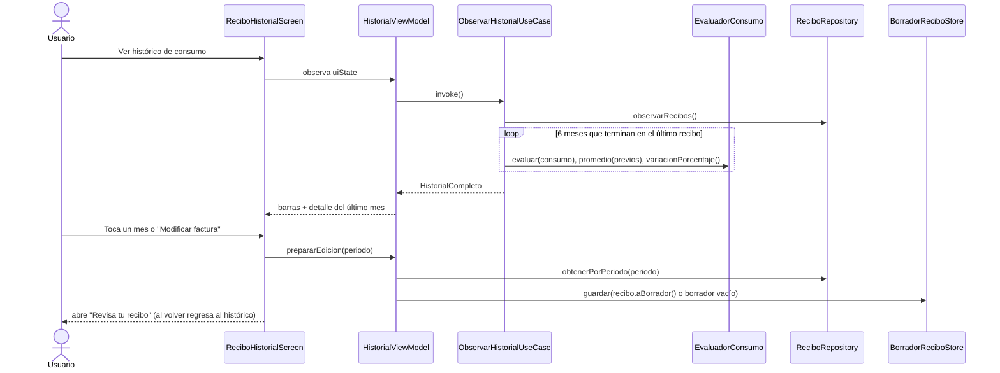
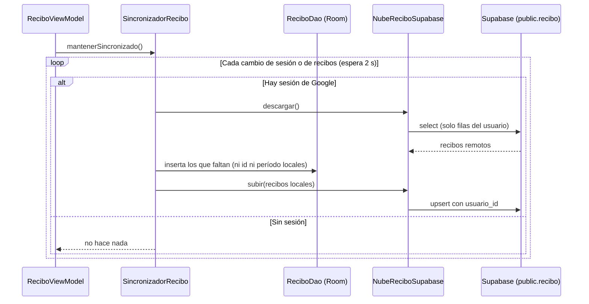
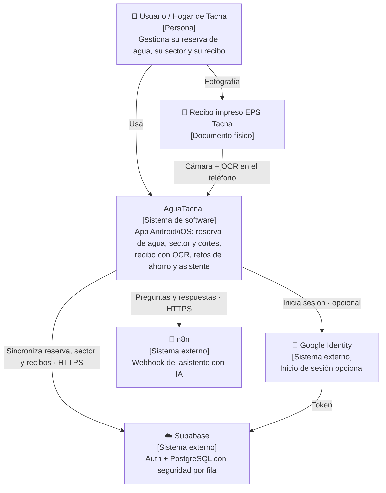
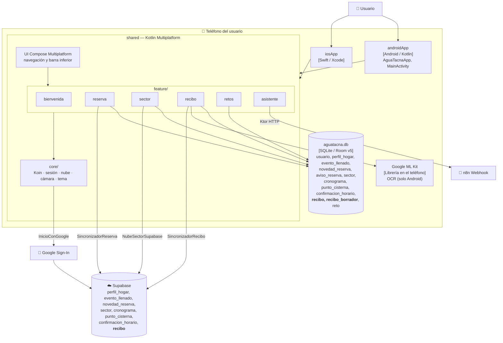
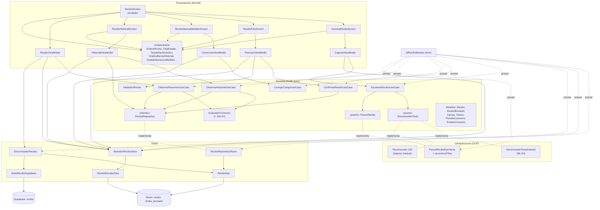

# Informe técnico — Módulo **Recibo** de AguaTacna

> Estado del código actual en `main` (incluye la simplificación de la interfaz) · 01/10/2026
> Ruta del módulo: `shared/src/commonMain/kotlin/pe/edu/upt/aguatacna/feature/recibo/`
> Responsable del módulo: Iker Alberto Sierra Ruiz

---

## 1. Contexto: ¿qué hace este módulo?

El módulo Recibo digitaliza el recibo de agua de **EPS Tacna** y ayuda al hogar a vigilar su consumo:

1. **Fotografía** el recibo con la cámara del teléfono.
2. **Lee** la foto con OCR en el propio teléfono (Google ML Kit, sin internet) y extrae período, consumo en m³, importe, fechas, lecturas, medidor y número de recibo.
3. Deja **revisar y corregir** cada dato antes de guardarlo, o ingresarlo todo a mano.
4. **Guarda** el recibo en la base local (Room / SQLite) y, si el usuario entró con Google, lo **copia a Supabase** para no perderlo al cambiar de teléfono.
5. Muestra el **último recibo** (importe, vencimiento, consumo) y un **histórico de 6 meses**.
6. Marca **"Alto consumo"** cuando un mes supera **100 m³**; si no, **"Normal"**.

Reglas que respeta (constitución del proyecto): el dominio es Kotlin puro, la base local es la fuente de verdad, la foto nunca se guarda, no se guardan datos personales (nombre, DNI, dirección) y el dinero se maneja en céntimos (`Long`), nunca en `Double`.

---

## 2. ¿Cuántos archivos tiene?

Conteo hecho con `find`, `wc -l` y `grep` sobre el código actual (no son estimados).

### 2.1 Resumen

| Source set | Archivos `.kt` | Líneas | Contenido |
|---|---|---|---|
| `commonMain/feature/recibo` | **54** (+2 `.gitkeep`) | **3 534** | Todo el módulo: dominio, datos, OCR, DI y pantallas |
| `androidMain/feature/recibo` | 2 | 65 | OCR real con ML Kit |
| `iosMain/feature/recibo` | 1 | 19 | OCR de iOS (pide ingreso manual) |
| `commonTest/feature/recibo` | 12 | 1 054 | Pruebas de dominio, parser y casos de uso |
| `androidHostTest/feature/recibo` | 4 | 335 | Pruebas de Room, borrador y sincronización |
| **Total** | **73** | **5 007** | |

Las líneas cuentan imports, comentarios y líneas en blanco.

### 2.2 Líneas por capa (`commonMain`)

| Capa | Archivos | Líneas | % |
|---|---|---|---|
| `domain/` | 15 | 689 | 19 % |
| `data/` | 9 | 436 | 12 % |
| `infrastructure/ocr/` | 3 | 157 | 5 % |
| `di/` | 1 | 44 | 1 % |
| `presentation/` (pantallas y ViewModels) | 10 | 845 | 24 % |
| `presentation/componentes/` | 16 | 1 363 | 39 % |
| **Total** | **54** | **3 534** | |

### 2.3 Detalle por archivo (`commonMain`)

| Capa | Archivo | Líneas | `fun` |
|---|---|---|---|
| **di** | `ReciboModule.kt` | 44 | 0 |
| **domain/model** | `Dinero.kt` | 56 | 8 |
| | `ModelosSoporte.kt` (Campo, OrigenDatos, TipoConsumo, EstadoConsumo, LineaTexto, TextoReconocido) | 71 | 3 |
| | `PeriodoConsumo.kt` | 107 | 6 |
| | `Recibo.kt` | 36 | 1 |
| | `ReciboBorrador.kt` | 58 | 2 |
| **domain/port** | `ParserRecibo.kt` | 16 | 2 |
| | `ReconocedorTexto.kt` | 8 | 1 |
| **domain/repository** | `ReciboRepository.kt` | 21 | 4 |
| **domain/service** | `EvaluadorConsumo.kt` | 23 | 3 |
| | `ValidadorRecibo.kt` | 43 | 1 |
| **domain/usecase** | `ConfirmarReciboUseCase.kt` | 39 | 2 |
| | `CorregirCampoUseCase.kt` | 78 | 3 |
| | `EscanearReciboUseCase.kt` | 36 | 1 |
| | `ObservarHistorialUseCase.kt` | 62 | 2 |
| | `ObservarResumenUseCase.kt` | 35 | 1 |
| **data** | `BorradorReciboStore.kt` | 51 | 3 |
| | `FakeReciboRepository.kt` | 38 | 5 |
| | `ReciboRepositoryRoom.kt` | 33 | 4 |
| **data/local** | `ReciboDao.kt` | 23 | 4 |
| | `ReciboEntity.kt` | 60 | 2 |
| | `ReciboBorradorDao.kt` | 19 | 3 |
| | `ReciboBorradorEntity.kt` | 98 | 6 |
| **data/sync** | `SincronizadorRecibo.kt` (+ interfaz `NubeRecibo`) | 62 | 5 |
| | `NubeReciboSupabase.kt` | 52 | 4 |
| **infrastructure/ocr** | `ParserReciboEpsTacna.kt` | 127 | 12 |
| | `ReconstructorFilas.kt` | 24 | 2 |
| | `ReconocedorTextoPlataforma.kt` (`expect`) | 6 | 1 |
| **presentation** (ViewModels) | `ReciboViewModel.kt` | 91 | 4 |
| | `CapturaViewModel.kt` | 92 | 6 |
| | `RevisionViewModel.kt` | 70 | 3 |
| | `CorreccionViewModel.kt` (+ `aplicarTecla`) | 85 | 6 |
| | `HistorialViewModel.kt` | 58 | 2 |
| **presentation** (pantallas) | `ReciboScreen.kt` | 134 | 2 |
| | `CamaraReciboScreen.kt` | 60 | 1 |
| | `ReciboFotoScreen.kt` | 100 | 3 |
| | `ReciboManualMedidorScreen.kt` | 84 | 1 |
| | `ReciboHistorialScreen.kt` | 71 | 1 |
| **presentation/componentes** | `EstilosRecibo.kt` (colores, `estilo()`, `tarjeta()`, `caja()`, `IconoEnCaja`, `EtiquetaSeccion`) | 101 | 5 |
| | `ChipEstado.kt` (`EstiloEstado`, `BadgeEstado`, `ChipEstado`) | 50 | 3 |
| | `ReciboBarraSuperior.kt` | 58 | 1 |
| | `TarjetaReciboActivo.kt` | 131 | 4 |
| | `TarjetasEscaneo.kt` | 92 | 2 |
| | `SeccionHerramientas.kt` | 69 | 3 |
| | `AvisosCamara.kt` | 151 | 8 |
| | `AvisosRevision.kt` | 93 | 4 |
| | `TarjetaDocumentoRecibo.kt` | 72 | 3 |
| | `ListaCamposRevision.kt` | 92 | 2 |
| | `TipoCampoEdicion.kt` | 13 | 0 |
| | `DisplayDigitosMedidor.kt` | 98 | 3 |
| | `TecladoNumericoMedidor.kt` | 62 | 1 |
| | `SelectorPeriodoMeses.kt` | 76 | 2 |
| | `GraficoBarrasHistorial.kt` | 122 | 5 |
| | `DetallePeriodoHistorial.kt` | 83 | 3 |

Fuera del módulo, Recibo usa: `core/db/AguaTacnaDatabase.kt` (tablas `recibo` y `recibo_borrador`, versión 5), `core/di/InicioAndroid.kt` (registra los DAO), `core/util/capturaFoto.kt` (cámara y permiso) y la migración `supabase/migrations/20260929_recibo_tabla_inicial.sql`.

---

## 3. ¿Cuántas funciones tiene?

| Tipo | Cantidad |
|---|---|
| Declaraciones `fun` en `commonMain` | **169** |
| + `androidMain` (`reconocer`, `crearReconocedorTexto`) | 2 |
| + `iosMain` (`crearReconocedorTexto`, `reconocer`) | 2 |
| **Total del módulo** | **173** |
| De ellas, pantallas y componentes `@Composable` | 53 |
| De ellas, firmas abstractas (DAO, puertos, repositorio, `NubeRecibo`) + 1 `expect` | 17 |
| Pruebas `@Test` | **77** |

Clases principales: 5 casos de uso, 2 servicios de dominio, 5 ViewModels, 5 pantallas, 4 interfaces (2 puertos, repositorio, `NubeRecibo`), 2 DAO, 2 entidades Room y 1 sincronizador.

---

## 4. Estructura

Arquitectura limpia con **DDD** (modelos, servicios, casos de uso y puertos en el dominio), **MVVM** en la presentación y **puertos y adaptadores** para el OCR.

```
feature/recibo/
├── domain/                         ← Núcleo puro: solo Kotlin, corrutinas y kotlinx-datetime
│   ├── model/
│   │   ├── Recibo.kt                  Recibo confirmado (+ aBorrador())
│   │   ├── ReciboBorrador.kt          Recibo en revisión: cada dato con su confianza (Campo<T>)
│   │   ├── Dinero.kt                  Importe en céntimos; "S/ 74,20"
│   │   ├── PeriodoConsumo.kt          Año + mes; "Set"; vencimiento() = 11 del mes siguiente
│   │   └── ModelosSoporte.kt          Campo, OrigenDatos, TipoConsumo, EstadoConsumo, LineaTexto, TextoReconocido
│   ├── port/
│   │   ├── ReconocedorTexto.kt        Puerto del OCR (foto → texto)
│   │   └── ParserRecibo.kt            Puerto del parser (texto → borrador)
│   ├── repository/ReciboRepository.kt Contrato de persistencia
│   ├── service/
│   │   ├── EvaluadorConsumo.kt        Regla única: > 100 m³ = ALTO_CONSUMO; promedio y variación
│   │   └── ValidadorRecibo.kt         Advertencias de coherencia (no bloquean)
│   └── usecase/
│       ├── EscanearReciboUseCase.kt   Foto → OCR → parser → borrador
│       ├── CorregirCampoUseCase.kt    Valida y corrige un campo
│       ├── ConfirmarReciboUseCase.kt  Guarda o rechaza (Guardado / Duplicado / Incompleto)
│       ├── ObservarResumenUseCase.kt  Último recibo para la pantalla principal
│       └── ObservarHistorialUseCase.kt Ventana de 6 meses para el gráfico
├── infrastructure/ocr/             ← Adaptadores del OCR
│   ├── ParserReciboEpsTacna.kt        Regex del recibo de EPS Tacna
│   ├── ReconstructorFilas.kt          Une etiqueta y valor que ML Kit separa
│   └── ReconocedorTextoPlataforma.kt  expect fun crearReconocedorTexto()
│       (androidMain: ML Kit · iosMain: aviso de ingreso manual)
├── data/                           ← Adaptadores de persistencia
│   ├── ReciboRepositoryRoom.kt        Implementación real (Room)
│   ├── FakeReciboRepository.kt        En memoria, para pruebas y vistas previas
│   ├── BorradorReciboStore.kt         Borrador en revisión (memoria + Room)
│   ├── local/                         ReciboEntity/Dao, ReciboBorradorEntity/Dao
│   └── sync/                          SincronizadorRecibo, NubeReciboSupabase
├── di/ReciboModule.kt              ← Koin: une puertos con sus implementaciones
└── presentation/                   ← MVVM
    ├── ReciboScreen.kt                Enrutador interno (principal, cámara, revisión, corrección, historial)
    ├── CamaraReciboScreen.kt / CapturaViewModel.kt
    ├── ReciboFotoScreen.kt / RevisionViewModel.kt              "Revisa tu recibo"
    ├── ReciboManualMedidorScreen.kt / CorreccionViewModel.kt   Teclado de corrección
    ├── ReciboHistorialScreen.kt / HistorialViewModel.kt        Gráfico de 6 meses
    ├── ReciboViewModel.kt             Pantalla principal + sincronización
    └── componentes/                   16 piezas visuales reutilizables (ver 2.3)
```

**Regla de dependencias:** `presentation → domain ← data / infrastructure`. El dominio no conoce Room, Koin, Supabase ni Android; las capas externas implementan sus puertos (`ReconocedorTexto`, `ParserRecibo`, `ReciboRepository`) y Koin las conecta en `ReciboModule`.

| Tecnología | Uso en Recibo |
|---|---|
| Kotlin Multiplatform · Compose Multiplatform | Lenguaje y toda la interfaz |
| Koin | `moduloRecibo`: parser, reconocedor, store, sincronizador y casos de uso |
| Room KMP | Tablas `recibo` y `recibo_borrador` en `aguatacna.db` |
| Supabase (Auth + PostgREST) | Tabla `recibo` con seguridad por fila |
| kotlinx.serialization | Borrador en JSON y DTO `ReciboNube` |
| Google ML Kit Text Recognition | OCR en Android |
| FileKit · moko-permissions | Cámara y permiso |
| kotlinx-datetime · corrutinas · Flow | Fechas y reactividad |

---

## 5. ¿Cómo se conecta cada apartado y cómo funciona?

### 5.1 Pantallas y navegación

`ReciboScreen` no usa NavHost: cambia de sub-pantalla con una variable guardada (`subPantalla`) y recuerda de dónde se vino (`origenRevision`) para volver al lugar correcto.

```
principal ──Escanear──────► camara ──OCR ok──► foto (Revisa tu recibo) ──Confirmar──► principal
   │                          │                   │  ▲
   │                          └─Ingresar a mano─► manualMedidor (corregir un campo)
   ├──Ingresar manual──► foto
   ├──Revisar lectura──► foto
   └──Ver histórico────► historial ──tocar un mes / Modificar──► foto ──Volver o Confirmar──► historial
```

Tocar el ícono **Recibo** de la barra inferior desde cualquier sub-pantalla regresa a `principal`.

### 5.2 ViewModels: quién orquesta qué

| ViewModel | Usa | Qué hace |
|---|---|---|
| `ReciboViewModel` | `ObservarResumenUseCase`, `BorradorReciboStore`, `Reloj`, `SincronizadorRecibo` | Muestra el último recibo; prepara el borrador para "Revisar" o "Ingresar a mano"; mantiene la sincronización mientras vive |
| `CapturaViewModel` | `EscanearReciboUseCase`, `BorradorReciboStore`, `Reloj` | Recibe la foto, corre el OCR fuera del hilo principal, guarda el borrador y descarta la foto |
| `RevisionViewModel` | `ConfirmarReciboUseCase`, `ValidadorRecibo`, `BorradorReciboStore` | Muestra el borrador y sus advertencias; confirma y traduce el resultado (duplicado, guardado) |
| `CorreccionViewModel` | `CorregirCampoUseCase`, `BorradorReciboStore`, `Reloj` | Convierte lo tecleado en un campo corregido o devuelve el mensaje de error |
| `HistorialViewModel` | `ObservarHistorialUseCase`, `ReciboRepository`, `BorradorReciboStore` | Muestra los 6 meses; prepara el borrador del mes que se quiere modificar |

Los ViewModels **no calculan**: el estado de consumo, el promedio, la variación, las validaciones y la regla de duplicados viven en el dominio.

### 5.3 El borrador: el hilo que une las pantallas

`BorradorReciboStore` guarda el `ReciboBorrador` que se está revisando. Lo escriben la cámara (OCR), "Ingresar a mano", "Revisar lectura" y el historial; lo leen la revisión y la corrección. Cada cambio se copia a la tabla `recibo_borrador` (una sola fila con JSON), así que **si el sistema cierra la app, el borrador se restaura** al volver.

Cada dato del borrador es un `Campo<T>`: valor + confianza (0 a 1) + si lo corrigió el usuario. Un campo con confianza menor a 0,7 se marca como **dudoso** (ícono naranja y chip "Revisa los datos").

### 5.4 Reglas de negocio (dominio)

| Regla | Dónde |
|---|---|
| Un mes con **más de 100 m³** es `ALTO_CONSUMO`; si no, `NORMAL` | `EvaluadorConsumo.evaluar` |
| Promedio = media de hasta 6 meses previos; variación = (consumo − promedio) / promedio | `EvaluadorConsumo.promedio`, `variacionPorcentaje` |
| Confirmar exige período + consumo + importe; lo que falte queda en `null` (no se inventan datos) | `ReciboBorrador.confirmar` |
| Un mes solo admite un recibo; editar uno existente lo reemplaza; moverlo a un mes ocupado es **duplicado** | `ConfirmarReciboUseCase` |
| Los recibos nuevos reciben un id `recibo-<uuid>`; uno editado conserva el suyo aunque cambie de mes | `ConfirmarReciboUseCase` |
| Consumo 0–999; lecturas ≥ 0 con anterior ≤ actual; importe > 0 y ≤ S/ 99 999 | `CorregirCampoUseCase` |
| Al corregir una lectura, el consumo pasa a ser actual − anterior | `CorregirCampoUseCase` |
| Advertencias: consumo fuera de rango, vencimiento antes de la emisión, lecturas que no cuadran | `ValidadorRecibo` |
| El vencimiento mostrado es siempre el **11 del mes siguiente** al consumo | `PeriodoConsumo.vencimiento()` |
| El importe se guarda en céntimos y se redondea al escribirlo (78,29 → 7 829) | `Dinero.parsear` |

### 5.5 Componentes visuales

La interfaz comparte sus piezas en `presentation/componentes/EstilosRecibo.kt`:

- `estilo(tamaño, peso, color)`: estilo de texto en una línea.
- `Modifier.tarjeta()` y `Modifier.caja()`: tarjeta blanca con sombra y caja con fondo y borde.
- `IconoEnCaja`, `EtiquetaSeccion` y los colores del módulo.

Además, `ChipEstado` sirve para todos los chips ("Alto consumo", "Normal", "Leído", "Manual", "Revisa los datos") y `Aviso` para el aviso naranja y el consejo azul de la revisión.

---

## 6. El proceso de OCR: de la imagen a la información

### 6.1 Las tres piezas

| Paso | Pieza | Qué hace |
|---|---|---|
| 1 | `EscanearReciboUseCase` | Recibe los bytes de la foto, valida que no esté vacía y coordina los pasos 2 y 3 |
| 2 | `ReconocedorTexto` (`ReconocedorTextoAndroid`) | bytes → `Bitmap` → `InputImage` → **ML Kit Text Recognition** (modelo latino, en el teléfono). Devuelve `TextoReconocido`: el **texto plano** y cada **línea con su posición** (x, y, ancho, alto) |
| 3 | `ParserRecibo` (`ParserReciboEpsTacna`) | Convierte ese texto en un `ReciboBorrador` con un valor y una confianza por campo |

En iOS, `crearReconocedorTexto()` devuelve un reconocedor que falla con "En iOS aún no se puede leer el recibo con la cámara. Ingresa los datos a mano.", y la pantalla de error ofrece el ingreso manual.

### 6.2 Dentro del parser

1. **Normaliza** el texto: mayúsculas, sin tildes, `M3` / `M 3` → `M³`, sin asteriscos (`*****78.00` → `78.00`).
2. **Lee dos veces:**
   - el **texto plano** tal como lo da ML Kit;
   - el **texto rearmado por filas** con `reconstruirFilas`: ordena las líneas por su altura, junta las que están en la misma fila (a menos de medio alto de línea) y las une de izquierda a derecha. En la tabla "DETALLES DE CONSUMO", ML Kit devuelve las etiquetas ("PROMEDIO m³") y los valores ("23") en **bloques separados**; al rearmar las filas queda `PROMEDIO M³  23`.
3. **Extrae cada campo** con expresiones regulares propias del recibo de EPS Tacna:

| Campo | Busca | Confianza |
|---|---|---|
| Período | `CONSUMO: AGOSTO-2026` · respaldo: cualquier "MES-AÑO" | 0,95 · 0,70 |
| Consumo m³ | `VOLUMEN FAC m³ 23` · `PROMEDIO m³ 23` · `CONSUMO FACTURADO 23` | 0,95 · 0,90 · 0,75 |
| Importe | `TOTAL A PAGAR S/ 78.00` · respaldo: el último `S/ xx.xx` | 0,95 · 0,65 |
| Tipo de consumo | `TIPO CONSUMO: PROMEDIO / LECTURA` | 0,90 |
| Emisión / vencimiento | `FECHA DE EMISION 31/08/2026` | 0,95 |
| Lecturas | `LECTURA ANTERIOR 100`, `LECTURA ACTUAL 125` | 0,90 |
| Medidor / N.º de recibo | `MEDIDOR > Numero: EA18490784`, `Nº Rec: S001-7264721` | 0,90 · 0,95 |

   Las regex del consumo toleran que el "³" se lea como `²`, `ª`, `°` o `'`, y exigen la `M` de la unidad para no confundir "Tipo Consumo: PROMEDIO" ni "MEDIDOR" con un consumo.
4. **Combina** las dos lecturas campo por campo: manda el texto plano, salvo que el de filas tenga un valor que falta o más confianza.
5. **Valida el mínimo:** si no encontró ni consumo ni importe, responde "No pudimos leer el consumo ni el importe total de tu recibo." y la app ofrece tomar otra foto o ingresar los datos a mano.

El parser **nunca extrae** nombre, DNI, dirección ni claves aunque aparezcan en el recibo.

### 6.3 Después del OCR

El borrador se guarda en `BorradorReciboStore`, la foto se descarta de memoria y se abre "Revisa tu recibo". Los campos dudosos se resaltan y el usuario puede corregir cualquiera antes de confirmar.

---

## 7. Requerimientos

### 7.1 Requerimientos funcionales

| ID | Requerimiento | Dónde se implementa |
|---|---|---|
| RF-01 | Capturar una foto del recibo pidiendo el permiso de cámara | `CamaraReciboScreen`, `core/util/capturaFoto` |
| RF-02 | Reconocer el texto de la foto con OCR local (Android) | `ReconocedorTextoAndroid` |
| RF-03 | En iOS, avisar que el OCR no está disponible y ofrecer el ingreso manual | `ReconocedorTextoPlataforma.ios.kt` + `PantallaErrorLectura` |
| RF-04 | Extraer período, consumo, importe, tipo, fechas, lecturas, medidor y N.º de recibo, aunque etiquetas y valores salgan en bloques distintos | `ParserReciboEpsTacna`, `reconstruirFilas` |
| RF-05 | Indicar la confianza y resaltar los datos dudosos (< 70 %) | `Campo.esDudoso`, `ChipEstado` |
| RF-06 | Mostrar advertencias de coherencia sin bloquear la confirmación | `ValidadorRecibo`, `AvisoRevision` |
| RF-07 | Ingresar un recibo a mano con el mes actual | `ReciboBorrador.vacio`, `iniciarManual()` |
| RF-08 | Corregir período, consumo e importe con validación (la primera tecla reemplaza el valor detectado) | `CorregirCampoUseCase`, `CorreccionViewModel`, `aplicarTecla` |
| RF-09 | Confirmar con período + consumo + importe | `ConfirmarReciboUseCase` |
| RF-10 | Impedir dos recibos del mismo mes, pero permitir **modificar** uno existente o moverlo de mes | `ResultadoConfirmacion.Duplicado`, `idRecibo` |
| RF-11 | Resumen del último recibo: importe, vencimiento (11 del mes siguiente) y consumo | `ObservarResumenUseCase`, `TarjetaReciboActivo` |
| RF-12 | Marcar **Alto consumo** cuando un mes supera 100 m³ | `EvaluadorConsumo`, `EstadoConsumo.ALTO_CONSUMO` |
| RF-13 | Histórico de los 6 meses que terminan en el último recibo; tocar un mes abre su edición | `ObservarHistorialUseCase`, `HistorialViewModel` |
| RF-14 | Detalle del último mes con consumo, promedio histórico, variación e importe | `DetallePeriodoHistorial` |
| RF-15 | Volver al histórico al salir o confirmar una revisión abierta desde el histórico | `ReciboScreen` (`origenRevision`) |
| RF-16 | Conservar el borrador si el sistema cierra la app durante la revisión | `BorradorReciboStore` + `recibo_borrador` |
| RF-17 | Con cuenta de Google, copiar los recibos a la nube y recuperarlos en otro teléfono | `SincronizadorRecibo`, `NubeReciboSupabase` |

### 7.2 Requerimientos no funcionales

| ID | Requerimiento | Evidencia |
|---|---|---|
| RNF-01 | **Privacidad**: la foto nunca se guarda | `CapturaViewModel.liberarFoto()` |
| RNF-02 | **Privacidad**: sin nombre, DNI ni dirección en Room ni en Supabase; seguridad por fila en la nube | `ReciboEntity`, `BorradorGuardado`, migración `20260929_recibo_tabla_inicial.sql` |
| RNF-03 | **Sin conexión como base**: Room es la fuente de verdad; la nube solo copia | `SincronizadorRecibo` (errores de red → `false`) |
| RNF-04 | **Exactitud monetaria**: céntimos `Long`, redondeo al escribir el importe | `Dinero` |
| RNF-05 | **Dominio puro**: `domain/` solo usa Kotlin estándar, corrutinas y kotlinx-datetime | Puertos inyectados por Koin |
| RNF-06 | **El ViewModel orquesta, no calcula**; los composables solo dibujan | Reglas en `EvaluadorConsumo`, `CorregirCampoUseCase`, `ConfirmarReciboUseCase` |
| RNF-07 | **UI reactiva**: se actualiza sola al cambiar la base | `Flow` + `StateFlow` |
| RNF-08 | **Multiplataforma** con `expect/actual` | `crearReconocedorTexto()` |
| RNF-09 | **OCR fuera del hilo principal** | `withContext(Dispatchers.Default)` |
| RNF-10 | **Usabilidad**: español, "S/ 74,20", meses "Set" | `Dinero`, `PeriodoConsumo` |
| RNF-11 | **Mantenibilidad**: piezas visuales compartidas; ningún archivo pasa de 150 líneas sin contar imports | `EstilosRecibo`, `componentes/` |
| RNF-12 | **Pruebas**: 77 pruebas del módulo | `commonTest` + `androidHostTest` |
| RNF-13 | **Esquema versionado**: Room v5 con `AutoMigration(4, 5)` y `schemas/.../5.json` | `AguaTacnaDatabase` |

---

## 8. ¿Cómo se guardan los datos? (con cuenta / sin cuenta)

### 8.1 Base de datos local

- **SQLite** con **Room**, archivo `aguatacna.db`, clase `core/db/AguaTacnaDatabase`, **versión 5**.
- Recibo es dueño de dos tablas:
  - `recibo`: los recibos confirmados (id, anio, mes, consumoM3, importeCentimos, fechas, tipoConsumo, lecturas, numeroMedidor, numeroRecibo, origen).
  - `recibo_borrador`: una sola fila `id = 1` con el borrador en revisión como JSON.

### 8.2 Proceso de guardado

1. El OCR, el ingreso manual o "Modificar" dejan un `ReciboBorrador` en `BorradorReciboStore`, que lo copia a `recibo_borrador`.
2. Las correcciones pasan por `CorregirCampoUseCase`.
3. Al pulsar **Confirmar**, `RevisionViewModel` llama a `ConfirmarReciboUseCase(borrador)`:
   - `Incompleto` si falta período, consumo o importe;
   - `Duplicado` si otro recibo (con otro id) ocupa ese mes;
   - si no, guarda con `idRecibo` (edición) o con un id nuevo `recibo-<uuid>`.
4. `ReciboRepositoryRoom.guardar()` hace upsert (reutiliza el id del recibo que ya ocupa el período).
5. Room emite el cambio; el resumen, el histórico y la sincronización se actualizan solos.
6. Se limpia el borrador (también de `recibo_borrador`) y se vuelve a la pantalla de origen.

### 8.3 Con cuenta (Google) y sin cuenta

| | **SIN_CUENTA** (invitado) | **GOOGLE** (con cuenta) |
|---|---|---|
| Dónde se guarda | Tabla `recibo` de `aguatacna.db` | Igual, y además una copia en `public.recibo` de Supabase |
| Cuándo sincroniza | Nunca | Al abrir la pestaña Recibo, al iniciar sesión y 2 s después de cada cambio |
| Qué baja de la nube | — | Recibos cuyo `id` **y** período no existen en el teléfono |
| Qué sube | — | Todos los recibos del teléfono (upsert; en conflicto gana el teléfono) |
| Borrados | — | No se propagan |
| Cambio de teléfono | Se pierden los recibos | Se restauran al entrar con la misma cuenta |
| Sin red | Funciona igual | Funciona igual; la sincronización se reintenta en el próximo cambio |

La tabla de Supabase usa la clave `(usuario_id, id)` y no el período, para que al mover un recibo de mes se actualice la misma fila. Tiene seguridad por fila: cada usuario solo ve y escribe sus propios recibos.



---

## 9. Diagrama de flujo



---

## 10. Diagramas de secuencia

### 10.1 Escanear un recibo y confirmarlo



### 10.2 Corregir un campo



### 10.3 Ver el histórico y modificar un mes



### 10.4 Sincronización con la cuenta de Google



---

## 11. Diagramas C4

> **C1 y C2** muestran **toda la aplicación AguaTacna**. **C3 y C4** muestran **solo el módulo Recibo**.

### 11.1 C1 — Contexto del sistema (toda la app)



### 11.2 C2 — Contenedores (toda la app)



### 11.3 C3 — Componentes (solo el módulo Recibo)



### 11.4 C4 — Código (solo el módulo Recibo)

```mermaid
classDiagram
    direction LR

    class ReconocedorTexto {
        <<interface>>
        +reconocer(bytes) Result~TextoReconocido~
    }
    class ReconocedorTextoAndroid
    class ParserRecibo {
        <<interface>>
        +parsear(texto) ResultadoParseo
        +parsearTexto(texto) ResultadoParseo
    }
    class ParserReciboEpsTacna {
        <<object>>
        +normalizar(texto) String
        -extraer(texto) ReciboBorrador
        -combinar(plano, filas) ReciboBorrador
        -buscarEntero() Campo
        -buscarTexto() Campo
        -buscarFecha() Campo
    }
    class EscanearReciboUseCase {
        +invoke(bytes) Result~ReciboBorrador~
    }
    class CorregirCampoUseCase {
        +invoke(borrador, campo) ResultadoCorreccion
    }
    class ResultadoCorreccion {
        <<sealed>>
        Aplicada(borrador)
        Invalida(mensaje)
    }
    class ConfirmarReciboUseCase {
        +invoke(borrador) ResultadoConfirmacion
    }
    class ResultadoConfirmacion {
        <<sealed>>
        Guardado(recibo, reemplazo)
        Duplicado(periodo)
        Incompleto
    }
    class ObservarResumenUseCase {
        +invoke() Flow~ResumenRecibo?~
    }
    class ObservarHistorialUseCase {
        +invoke() Flow~HistorialCompleto?~
    }
    class EvaluadorConsumo {
        <<object>>
        +LIMITE_M3 = 100
        +evaluar(consumo) EstadoConsumo
        +promedio(previos) Int?
        +variacionPorcentaje(consumo, promedio) Int?
    }
    class ValidadorRecibo {
        <<object>>
        +validar(borrador) List~Advertencia~
    }
    class EstadoConsumo {
        <<enum>>
        ALTO_CONSUMO
        NORMAL
    }
    class ReciboRepository {
        <<interface>>
        +observarRecibos() Flow
        +guardar(recibo)
        +obtenerPorPeriodo(periodo) Recibo?
        +eliminar(id)
    }
    class ReciboRepositoryRoom
    class FakeReciboRepository
    class BorradorReciboStore {
        +borrador: StateFlow
        +asegurar(crear)
        +guardar(b)
        +limpiar()
    }
    class ReciboBorradorDao {
        <<interface>>
        +obtener()
        +guardar(entity)
        +borrar()
    }
    class NubeRecibo {
        <<interface>>
        +descargar() List?
        +subir(recibos)
    }
    class NubeReciboSupabase
    class SincronizadorRecibo {
        +sincronizar() Boolean
        +mantenerSincronizado()
    }
    class Recibo {
        +id
        +periodoConsumo: PeriodoConsumo
        +consumoM3: Int
        +importeTotal: Dinero
        +aBorrador() ReciboBorrador
    }
    class ReciboBorrador {
        +idRecibo: String?
        +esConfirmable: Boolean
        +tieneCamposDudosos: Boolean
        +confirmar(id) Recibo
        +vacio(periodo)$ ReciboBorrador
    }
    class Campo~T~ {
        +valor: T?
        +confianza: Float
        +esDudoso: Boolean
        +corregir(valor)
    }
    class PeriodoConsumo {
        +anio
        +mes
        +vencimiento() LocalDate
        +parsear(texto)$
        +de(fecha)$
    }
    class Dinero {
        +centimos: Long
        +formatear() String
        +parsear(texto)$
    }
    class CapturaViewModel
    class RevisionViewModel
    class CorreccionViewModel
    class HistorialViewModel
    class ReciboViewModel

    ReconocedorTexto <|.. ReconocedorTextoAndroid
    ParserRecibo <|.. ParserReciboEpsTacna
    ReciboRepository <|.. ReciboRepositoryRoom
    ReciboRepository <|.. FakeReciboRepository
    NubeRecibo <|.. NubeReciboSupabase
    EscanearReciboUseCase --> ReconocedorTexto
    EscanearReciboUseCase --> ParserRecibo
    ConfirmarReciboUseCase --> ReciboRepository
    ConfirmarReciboUseCase ..> ResultadoConfirmacion
    CorregirCampoUseCase ..> ResultadoCorreccion
    ObservarResumenUseCase --> EvaluadorConsumo
    ObservarHistorialUseCase --> EvaluadorConsumo
    EvaluadorConsumo ..> EstadoConsumo
    BorradorReciboStore --> ReciboBorradorDao
    SincronizadorRecibo --> NubeRecibo
    ReciboBorrador --> Campo
    ReciboBorrador ..> Recibo : confirmar
    Recibo --> PeriodoConsumo
    Recibo --> Dinero
    CapturaViewModel --> EscanearReciboUseCase
    RevisionViewModel --> ConfirmarReciboUseCase
    RevisionViewModel --> ValidadorRecibo
    CorreccionViewModel --> CorregirCampoUseCase
    HistorialViewModel --> ObservarHistorialUseCase
    ReciboViewModel --> ObservarResumenUseCase
    ReciboViewModel --> SincronizadorRecibo
    CapturaViewModel --> BorradorReciboStore
    RevisionViewModel --> BorradorReciboStore
    CorreccionViewModel --> BorradorReciboStore
    HistorialViewModel --> BorradorReciboStore
```



---

## 12. Cómo funciona todo el módulo (de punta a punta)

1. **Arranque.** Al iniciar la app, Koin registra el módulo Recibo: repositorio Room, store del borrador (que restaura un borrador pendiente si lo había), parser, reconocedor de la plataforma, sincronizador y casos de uso.
2. **Pantalla principal.** Al abrir la pestaña, `ReciboViewModel` empieza a observar la tabla `recibo` y arranca la sincronización (solo actúa si hay sesión de Google). Si no hay recibos, muestra "Escanea tu recibo"; si los hay, el último con su importe, vencimiento (11 del mes siguiente), consumo y el chip **Normal** o **Alto consumo**.
3. **Entrada de datos**, por tres caminos que terminan en el mismo borrador:
   - **Escanear:** cámara → ML Kit → parser (texto plano + filas) → borrador con confianza por campo. La foto se descarta.
   - **Ingresar a mano:** borrador vacío con el mes actual.
   - **Revisar o modificar** (desde la principal o el histórico): borrador a partir del recibo guardado, con su `id`.
4. **Revisión.** "Revisa tu recibo" muestra los campos, marca los dudosos y las advertencias de coherencia. Tocar un campo abre el teclado: la primera tecla reemplaza el valor y `CorregirCampoUseCase` valida antes de aplicar.
5. **Confirmación.** `ConfirmarReciboUseCase` decide: si falta algo, no hace nada; si otro recibo ocupa el mes, muestra el aviso de duplicado; si no, guarda (o reemplaza el que se estaba editando) y limpia el borrador. Se vuelve a la pantalla de origen (principal o histórico).
6. **Reacción automática.** Room avisa del cambio y el resumen, el histórico y la sincronización con la nube se actualizan solos.
7. **Histórico.** Muestra los 6 meses que terminan en el último recibo, con la línea del límite de 100 m³ y las barras naranjas cuando hubo alto consumo. El detalle del último mes muestra consumo, promedio de los meses previos, variación e importe. Tocar un mes abre su edición.
8. **Sin internet**, todo lo anterior funciona igual; la nube solo es una copia y se pone al día cuando vuelve la conexión.

---

## 13. Pruebas

| Archivo | Qué prueba |
|---|---|
| `ParserReciboEpsTacnaTest` | Recibo real, lecturas, "³" mal leído, filas separadas por ML Kit, no inventa consumo |
| `EscanearReciboUseCaseTest` | Foto vacía, sin texto, error del OCR, lectura correcta |
| `ConfirmarReciboUseCaseTest` | Nuevo, incompleto, editar, duplicado, mover de mes |
| `CorregirCampoUseCaseTest` | Cada validación y el recálculo del consumo por lecturas |
| `EvaluadorConsumoTest` | Límite de 100 m³, promedio y variación |
| `ObservarHistorialUseCaseTest` | Ventana de 6 meses, meses vacíos, alto consumo |
| `FakeReciboRepositoryTest` | Upsert por período, resumen y vencimiento del 11 |
| `ValidadorReciboTest`, `DineroTest`, `PeriodoConsumoTest`, `AplicarTeclaTest` | Modelos y utilidades |
| `ReciboRepositoryRoomTest`, `BorradorReciboStoreTest`, `SincronizadorReciboTest` | Room, borrador persistente y sincronización |

**77 pruebas del módulo, todas en verde** (`./gradlew :shared:testAndroidHostTest`).

---

## 14. Observaciones

### 14.1 Observaciones del primer informe

| # | Observación | Estado |
|---|---|---|
| 1 | "Modificar" un recibo no se podía guardar | ✅ Corregida: `idRecibo` + `ResultadoConfirmacion` en el dominio |
| 2 | El dominio dependía de la infraestructura | ✅ Corregida: el parser se inyecta por Koin |
| 3 | Dos criterios de "Alto consumo" | ✅ Corregida: una sola regla (> 100 m³); se eliminó todo lo de reclamos ante Sunass |
| 4 | Valores escritos a mano (agosto 2026, medidor 0412887, fechas inventadas) | ✅ Corregida: `ReciboBorrador.vacio`, `PeriodoConsumo.de` y `Reloj` inyectado |
| 5 | `ValidadorRecibo` y `SemillaDepuracion` sin uso | ✅ Corregida: advertencias en la revisión; la semilla pasó a `commonTest/SemillaRecibos.kt` |
| 6 | Sin OCR en iOS | ✅ Corregida: `expect/actual`; iOS pide el ingreso manual |
| 7 | Sin sincronización con cuenta | ✅ Corregida: `SincronizadorRecibo` + tabla `recibo` en Supabase |
| 8 | Archivos de más de 150 líneas | ✅ Corregida con la simplificación de la interfaz: el archivo más grande es `AvisosCamara.kt` con 151 líneas contando imports (antes 759) |
| 9 | Lógica en la UI | ✅ Corregida: `CorreccionViewModel`, `aplicarTecla`, validaciones en `CorregirCampoUseCase`; sin `KoinPlatform` en las pantallas |
| 10 | El borrador vivía solo en memoria | ✅ Corregida: tabla `recibo_borrador` (Room v5) |

También se corrigieron:
- **OCR:** no leía el consumo cuando etiquetas y valores venían en bloques distintos.
- **Corrección de campos:** el importe escrito se truncaba (78,29 → 78,28). Además, el valor detectado no se podía reemplazar: "72,00" no aceptaba dígitos y "23" + 4 quedaba en "234".
- **Histórico:** la ventana podía empezar en el recibo más antiguo e incluir meses futuros vacíos.
- **Navegación:** al salir de una revisión abierta desde el histórico se volvía a la principal.

### 14.2 Observaciones vigentes

1. **La sincronización empieza al abrir la pestaña Recibo**, porque vive en `ReciboViewModel` (así no se toca `MainActivity`). En un teléfono nuevo, los recibos se restauran la primera vez que se entra a Recibo.
2. **Los borrados no se propagan** a la nube (igual que Reserva). Si más adelante se agrega "eliminar recibo", habrá que decidir cómo sincronizarlo.
3. **iOS todavía no arranca Koin**: `iosMain` no llama a `iniciarKoin` ni registra los DAO, así que las pantallas de Recibo aún no se pueden abrir en iOS. Además, `crearBaseDeDatos()` de iOS usa `fallbackToDestructiveMigration`, que la constitución (art. VI) prohíbe fuera del entorno local. Es código del core.
4. **"Revisa tu recibo" ya no muestra las lecturas anterior y actual**, pero `ValidadorRecibo` sigue avisando si no cuadran con el consumo. Un recibo con lecturas mal leídas muestra el aviso y no se puede corregir desde la app.
5. **`ReciboEntity` conserva valores por defecto de columna** (`anio = 2026`, `mes = 1`) que vienen de migraciones anteriores; no se usan desde el código, pero quitarlos cambiaría el esquema.
6. **Migración pendiente**: hay que aplicar `supabase/migrations/20260929_recibo_tabla_inicial.sql` en el proyecto Supabase "AguaTacna" si aún no se hizo; sin ella la sincronización con cuenta falla sin avisar.
