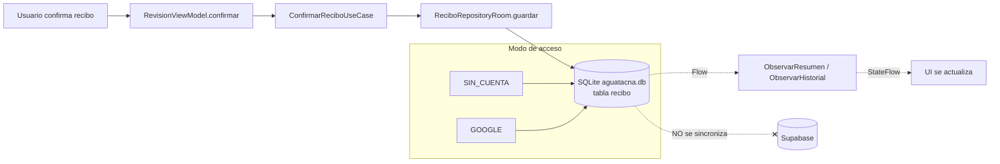
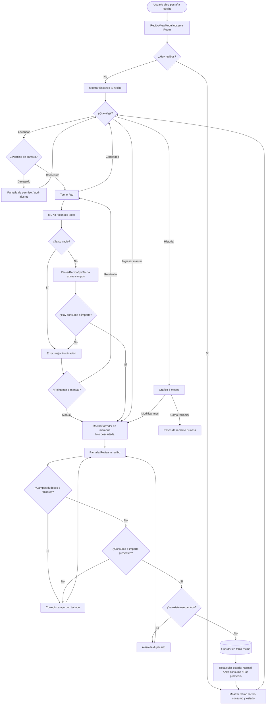
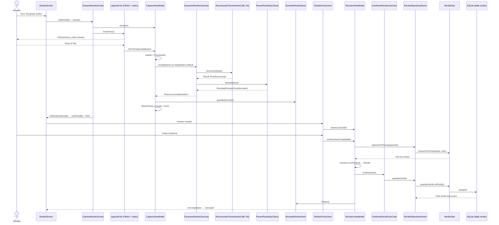
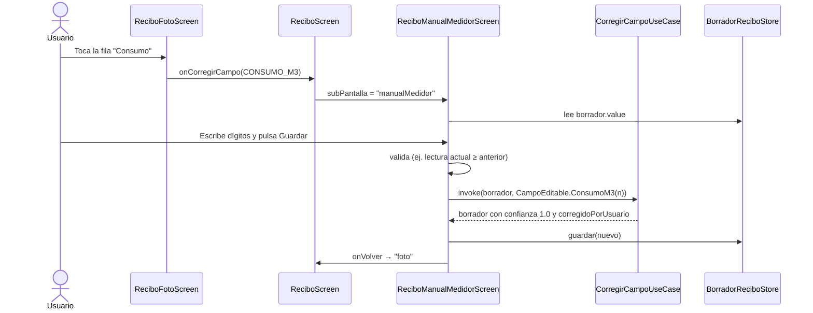
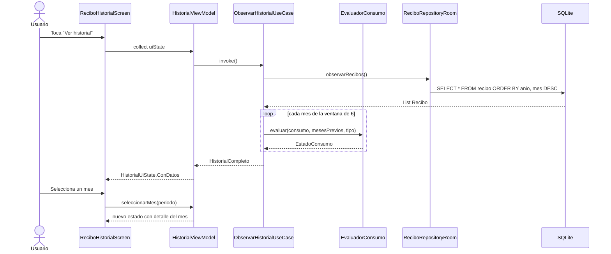
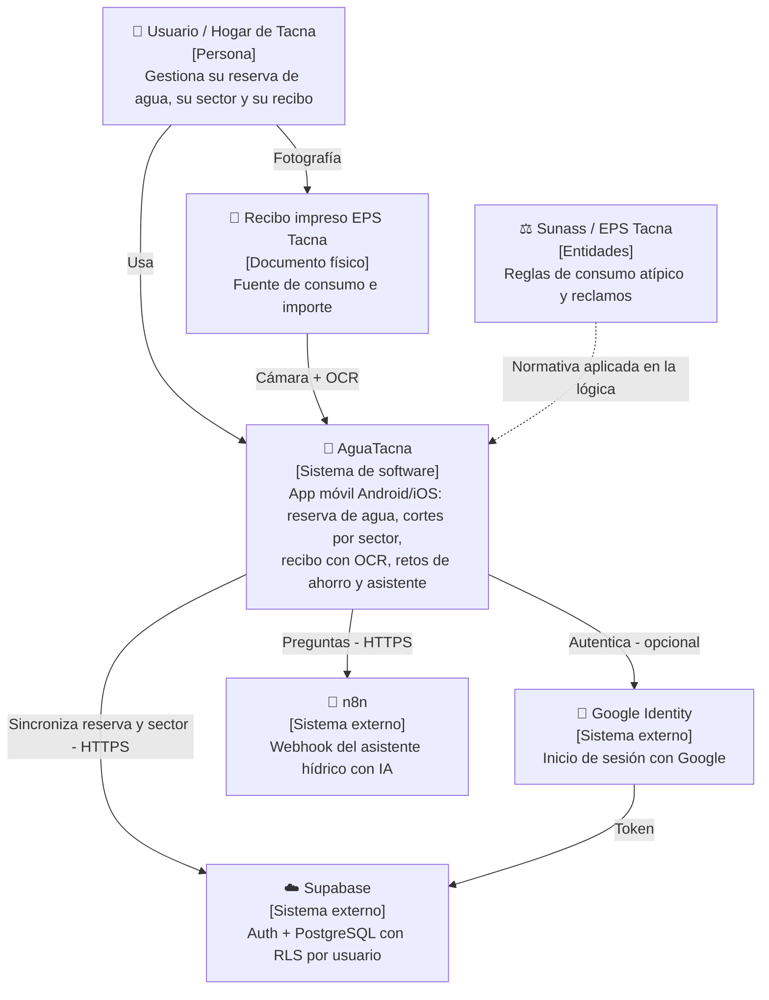
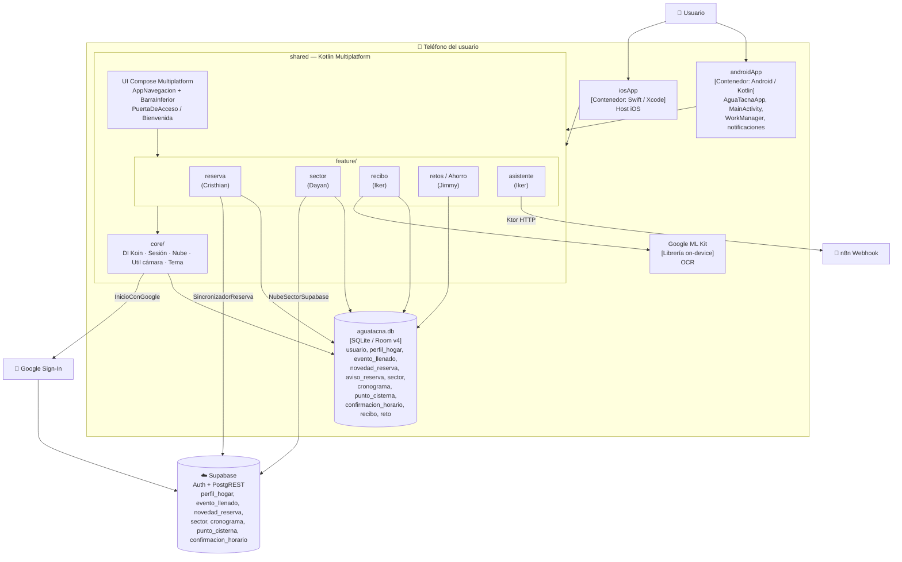
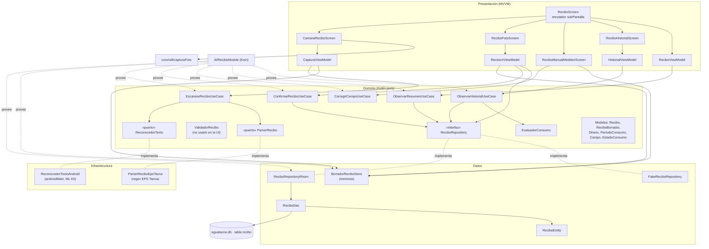

# Informe técnico — Módulo **Recibo** de AguaTacna

> Análisis de solo lectura: no se modificó ningún archivo del proyecto.
> Ruta del módulo: `shared/src/commonMain/kotlin/pe/edu/upt/aguatacna/feature/recibo/`
> Fecha del análisis: 28/09/2026 · Responsable del módulo: Iker Alberto Sierra Ruiz

---

## 1. Resumen en una frase

El módulo Recibo permite **fotografiar el recibo de agua de EPS Tacna**, convertir la foto en datos con **OCR local (Google ML Kit)**, que el usuario **revise y corrija** los campos, **guardarlo en la base de datos local (Room / SQLite)** y ver un **historial de 6 meses** que marca el consumo alto (> 100 m³) y explica cómo reclamar ante Sunass.

---

## 2. ¿Cuántos archivos tiene?

### 2.1 Carpeta del módulo (`commonMain/.../feature/recibo`)

| Métrica | Valor |
|---|---|
| Archivos totales | **38** |
| Archivos Kotlin (`.kt`) | **36** |
| Archivos `.gitkeep` (marcadores de carpeta) | 2 (`data/`, `domain/`) |
| Líneas de código Kotlin | **5 034** |

### 2.2 Archivos del módulo fuera de esa carpeta (mismo dueño)

| Source set | Archivo | Para qué |
|---|---|---|
| `androidMain` | `feature/recibo/infrastructure/ocr/ReconocedorTextoAndroid.kt` | Implementación real del OCR con Google ML Kit |
| `commonTest` | 8 archivos (`DineroTest`, `EscanearReciboUseCaseTest`, `EvaluadorConsumoTest`, `FakeReciboRepositoryTest`, `ObservarHistorialUseCaseTest`, `ParserReciboEpsTacnaTest`, `PeriodoConsumoTest`, `ValidadorReciboTest`) | 37 pruebas `@Test` |
| `androidHostTest` | `ReciboRepositoryRoomTest.kt` + `FakeReciboDao.kt` | 5 pruebas `@Test` del repositorio Room |
| `iosMain` | *(vacía)* | No hay OCR para iOS todavía |

### 2.3 Detalle por capa (carpeta principal)

| Capa | Archivo | Líneas |
|---|---|---|
| **di** | `ReciboModule.kt` | 26 |
| **domain/model** | `Dinero.kt` | 56 |
| | `ModelosSoporte.kt` (Campo, OrigenDatos, TipoConsumo, EstadoConsumo, LineaTexto, TextoReconocido) | 110 |
| | `PeriodoConsumo.kt` | 96 |
| | `Recibo.kt` | 36 |
| | `ReciboBorrador.kt` | 53 |
| **domain/port** | `ParserRecibo.kt` | 16 |
| | `ReconocedorTexto.kt` | 8 |
| **domain/repository** | `ReciboRepository.kt` | 21 |
| **domain/service** | `EvaluadorConsumo.kt` | 73 |
| | `ValidadorRecibo.kt` | 58 |
| **domain/usecase** | `EscanearReciboUseCase.kt` | 40 |
| | `ConfirmarReciboUseCase.kt` | 15 |
| | `CorregirCampoUseCase.kt` | 57 |
| | `ObservarResumenUseCase.kt` | 72 |
| | `ObservarHistorialUseCase.kt` | 143 |
| **data** | `BorradorReciboStore.kt` | 26 |
| | `ReciboRepositoryRoom.kt` | 33 |
| | `FakeReciboRepository.kt` | 34 |
| | `SemillaDepuracion.kt` | 41 |
| **data/local** | `ReciboDao.kt` | 23 |
| | `ReciboEntity.kt` | 60 |
| **infrastructure/ocr** | `ParserReciboEpsTacna.kt` | 230 |
| **presentation** (ViewModels) | `ReciboViewModel.kt` | 82 |
| | `CapturaViewModel.kt` | 84 |
| | `RevisionViewModel.kt` | 71 |
| | `HistorialViewModel.kt` | 104 |
| **presentation** (Pantallas) | `ReciboScreen.kt` | 261 |
| | `CamaraReciboScreen.kt` | 391 |
| | `ReciboFotoScreen.kt` | 230 |
| | `ReciboManualMedidorScreen.kt` | 266 |
| | `ReciboHistorialScreen.kt` | 183 |
| **presentation/componentes** | `ReciboGeneralComponentes.kt` | 759 |
| | `ReciboFotoComponentes.kt` | 362 |
| | `ReciboHistorialComponentes.kt` | 553 |
| | `ReciboManualComponentes.kt` | 361 |

---

## 3. ¿Cuántas funciones tiene?

| Tipo | Cantidad |
|---|---|
| Declaraciones `fun` en la carpeta principal | **115** |
| + `reconocer()` en `ReconocedorTextoAndroid` (androidMain) | 1 |
| **Total del módulo** | **116** |
| De ellas, funciones de UI `@Composable` | 36 |
| De ellas, funciones de lógica (dominio, datos, OCR, ViewModels) | 80 |
| De ellas, firmas abstractas de interfaces (repositorio, DAO, puertos) | 11 |

Clases principales: 5 casos de uso, 2 servicios de dominio, 4 ViewModels, 5 pantallas, 3 interfaces (puertos + repositorio), 1 DAO, 1 entidad Room.

---

## 4. Funciones del módulo y cómo se llaman

### 4.1 La función de OCR (foto → información)

El OCR **no es una sola función**, es una cadena de tres piezas:

| Paso | Clase · función | Qué hace |
|---|---|---|
| 1 | `EscanearReciboUseCase.invoke(bytesImagen: ByteArray)` | **Es el caso de uso "OCR"**. Recibe los bytes de la foto y devuelve `Result<ReciboBorrador>`. Orquesta los dos pasos siguientes. |
| 2 | `ReconocedorTextoAndroid.reconocer(bytesImagen)` | Convierte bytes → `Bitmap` → `InputImage` y llama a **Google ML Kit Text Recognition** (modelo latino, 100 % en el teléfono, sin internet). Devuelve `TextoReconocido` (texto plano + líneas con posición). |
| 3 | `ParserReciboEpsTacna.parsear(texto)` / `parsearTexto(texto)` | Normaliza el texto (mayúsculas, sin tildes, `M3→M³`) y extrae cada campo con **expresiones regulares** propias del recibo de EPS Tacna. Asigna a cada campo una **confianza** (0.95 si coincide con la etiqueta exacta, 0.65–0.75 si usó un respaldo). |

Extractores privados del parser (10): `extraerPeriodoConsumo`, `extraerConsumoM3`, `extraerImporteTotal`, `extraerTipoConsumo`, `extraerFechaEmision`, `extraerFechaVencimiento`, `extraerLecturaAnterior`, `extraerLecturaActual`, `extraerNumeroMedidor`, `extraerNumeroRecibo`, más `normalizar` y `parsearFecha`.

Si no encuentra **ni consumo ni importe**, responde `ResultadoParseo.NoLegible("No pudimos leer el consumo ni el importe total de tu recibo.")`.

### 4.2 Casos de uso (domain/usecase)

| Caso de uso | Función | Qué hace |
|---|---|---|
| `EscanearReciboUseCase` | `invoke(ByteArray)` | Foto → OCR → Parser → `ReciboBorrador` |
| `CorregirCampoUseCase` | `invoke(borrador, CampoEditable)` | Cambia un campo (consumo, lectura anterior/actual, importe, período), lo pone con confianza 1.0 y `corregidoPorUsuario = true` |
| `ConfirmarReciboUseCase` | `invoke(Recibo): Boolean` | Guarda el recibo (upsert por período) y devuelve `true` si reemplazó uno existente |
| `ObservarResumenUseCase` | `invoke(): Flow<ResumenRecibo?>` | Toma el recibo más reciente, calcula promedio, variación % y estado (Alto consumo si > 100 m³) |
| `ObservarHistorialUseCase` | `invoke(): Flow<HistorialCompleto?>` | Arma la ventana de 6 meses para el gráfico de barras con estado de cada mes |

### 4.3 Servicios de dominio

| Servicio | Funciones | Regla |
|---|---|---|
| `EvaluadorConsumo` | `evaluar(...)`, `calcularMetricas(...)` | Regla Sunass (art. 88): **atípico** si supera en > 100 % el promedio de hasta 6 meses previos; necesita mínimo 3 meses; si el recibo es "por PROMEDIO" devuelve `FacturadoPorPromedio` |
| `ValidadorRecibo` | `validar(recibo)` | Advertencias no bloqueantes: consumo 0–999, vencimiento ≥ emisión, `lecturaActual − lecturaAnterior = consumo`, lectura actual ≥ anterior |

### 4.4 Modelos (value objects)

| Modelo | Funciones destacadas |
|---|---|
| `Dinero` (céntimos en `Long`, nunca `Double`) | `formatear()` → "S/ 74,20", `formatearSoloNumero()`, `parsear("78.00")`, `desdeSoles()`, `plus`, `minus`, `compareTo` |
| `PeriodoConsumo` (año + mes) | `parsear("AGOSTO-2026")`, `anterior()`, `siguiente()`, `compareTo`, `mesCorto`, `mesLargo`, `displayCompleto` |
| `Campo<T>` | valor + `confianza` + `corregidoPorUsuario`; `esDudoso` si confianza < 0.7 |
| `ReciboBorrador` | `esConfirmable` (consumo + importe), `tieneCamposDudosos`, `confirmar(id)` → `Recibo` |
| `Recibo` | `aBorrador()` (para editarlo de nuevo) |
| `TipoConsumo` | `parsear()` → LECTURA / PROMEDIO / DESCONOCIDO |
| `EstadoConsumo` | `Atipico`, `Normal`, `SinHistorial`, `FacturadoPorPromedio` (cada uno trae su texto de chip y mensaje) |

### 4.5 Datos

| Clase | Funciones |
|---|---|
| `ReciboRepository` (interfaz) | `observarRecibos()`, `guardar()`, `obtenerPorPeriodo()`, `eliminar()` |
| `ReciboRepositoryRoom` | Implementación real sobre Room |
| `FakeReciboRepository` | Implementación en memoria para pruebas y vistas previas (+ `cargarTodos()`) |
| `ReciboDao` | `observarTodos()`, `buscarPorPeriodo(anio, mes)`, `guardar()` (`@Upsert`), `borrarPorId()` |
| `ReciboEntity` | `toDomain()`, `Recibo.toEntity()` |
| `BorradorReciboStore` | `guardar()`, `limpiar()`, `actualizar()` — guarda el borrador **solo en memoria** mientras dura la revisión |
| `SemillaDepuracion` | `generarRecibos()` — 6 recibos de ejemplo (mar–ago 2026) |

### 4.6 ViewModels (presentación)

| ViewModel | Funciones | Estado que expone |
|---|---|---|
| `ReciboViewModel` | `desdeInyeccion()`, `conDatosDePrueba()` | `ReciboUiState`: Cargando / SinRecibos / ConDatos |
| `CapturaViewModel` | `onFotoCapturada(bytes)`, `reiniciar()`, `liberarFoto()`, `onCleared()` | `CapturaUiState`: Inactivo / Procesando / Exito / Error |
| `RevisionViewModel` | `confirmar(onCompletado)`, `guardarBorrador()`, `descartar()`, `descartarError()` | `borrador` + `errorDuplicado` |
| `HistorialViewModel` | `seleccionarMes(periodo)`, `mostrarDialogoReclamo(bool)` | `HistorialUiState`: Cargando / SinHistorial / ConDatos |

### 4.7 Pantallas y componentes (@Composable)

| Pantalla | Qué muestra |
|---|---|
| `ReciboScreen` | **Enrutador interno** del módulo. Cambia entre sub-pantallas con la variable `subPantalla`: `principal`, `camara`, `foto`, `manualMedidor`, `historial` |
| `ReciboContenidoPrincipal` | Tarjeta del recibo activo, estado de consumo, botones "Escanear", "Ingresar manual", "Ver historial" |
| `CamaraReciboScreen` | Abre la cámara del sistema; muestra "Procesando OCR", errores o permisos denegados |
| `ReciboFotoScreen` | "Revisa tu recibo": lista de campos, chip *Leído / Revisa los datos / Manual*, botón Confirmar |
| `ReciboManualMedidorScreen` | Teclado numérico estilo medidor o selector de mes para corregir un campo |
| `ReciboHistorialScreen` | Gráfico de barras 6 meses, detalle del mes, diálogo "Cómo reclamar" |

Componentes: `TipInformativo`, `ZonaRetomarFoto`, `TarjetaDocumentoRecibo`, `ListaCamposRevision`, `FilaCampoRevision`, `BadgeEstado`, `ReciboBarraSuperior`, `TarjetaReciboActivo`, `TarjetaEscanearPrincipal`, `TarjetaEscanear`, `SeccionHerramientas`, `TarjetaHerramienta`, `GraficoBarrasHistorial`, `AlertaEstadoHistorial`, `DetallePeriodoHistorial`, `FilaDetalle`, `DialogoComoReclamar`, `PasoReclamo`, `DisplayDigitosMedidor`, `CajaDigito`, `TecladoNumericoMedidor`, `SelectorPeriodoMeses`, y privadas `PantallaProcesandoOcr`, `PantallaErrorLectura`, `PantallaPermisoDenegado`, `PantallaPermisoDenegadoPermanente`, `BotonesFlotantesRevision`, `BotonesAccionHistorial`, `BotonGuardarCorreccion`, `EncabezadoRecibo`.

---

## 5. Requerimientos

### 5.1 Requerimientos funcionales (lo que el código hace hoy)

| ID | Requerimiento | Dónde se implementa |
|---|---|---|
| RF-01 | Capturar una foto del recibo con la cámara, pidiendo el permiso de cámara | `CamaraReciboScreen`, `core/util/capturaFoto.kt` (FileKit + moko-permissions) |
| RF-02 | Reconocer el texto de la foto con OCR local | `ReconocedorTextoAndroid` (ML Kit) |
| RF-03 | Extraer del texto: período, consumo m³, importe, tipo de consumo, fechas de emisión y vencimiento, lecturas anterior/actual, N.º de medidor y N.º de recibo | `ParserReciboEpsTacna` |
| RF-04 | Indicar la confianza de cada dato y resaltar los dudosos (< 70 %) | `Campo.esDudoso`, chip "Revisa los datos" |
| RF-05 | Mostrar error claro y reintentar si no se pudo leer; ofrecer ingreso manual | `PantallaErrorLectura` |
| RF-06 | Ingresar un recibo manualmente (sin foto) | `onIngresarManual` → `OrigenDatos.MANUAL` |
| RF-07 | Corregir cualquier campo clave (consumo, lecturas, importe, período) | `ReciboManualMedidorScreen` + `CorregirCampoUseCase` |
| RF-08 | Confirmar y guardar el recibo; exigir mínimo consumo + importe | `RevisionViewModel.confirmar`, `esConfirmable` |
| RF-09 | Impedir dos recibos del mismo mes (aviso de duplicado) | `RevisionViewModel` (`errorDuplicado`) |
| RF-10 | Mostrar el resumen del último recibo: importe, vencimiento, consumo, variación vs. promedio | `ObservarResumenUseCase`, `ReciboViewModel` |
| RF-11 | Clasificar el consumo: Normal / Alto consumo (> 100 m³) / Registro (sin historial) / Por promedio | `EstadoConsumo`, `EvaluadorConsumo` |
| RF-12 | Ver el historial de 6 meses en gráfico de barras y seleccionar un mes | `ObservarHistorialUseCase`, `HistorialViewModel` |
| RF-13 | Explicar cómo reclamar ante EPS / Sunass | `DialogoComoReclamar` |
| RF-14 | Modificar un recibo desde el historial | `onModificarRecibo` (ver observación 11.1) |
| RF-15 | Volver a tomar la foto desde la revisión | `ZonaRetomarFoto` |

### 5.2 Requerimientos no funcionales

| ID | Requerimiento | Evidencia en el código |
|---|---|---|
| RNF-01 | **Privacidad**: la foto nunca se guarda; se descarta al terminar el OCR | `CapturaViewModel.liberarFoto()` |
| RNF-02 | **Privacidad**: no se extraen ni guardan datos personales (nombre, DNI, dirección) | Comentario del parser y de `ReciboEntity` (solo consumo y facturación) |
| RNF-03 | **Funciona sin internet** (OCR en el dispositivo, datos en SQLite local) | ML Kit on-device + Room · Constitución art. II |
| RNF-04 | **Exactitud monetaria**: dinero en céntimos `Long`, nunca `Double` | `Dinero` |
| RNF-05 | **Dominio puro** sin Android/Room/Koin, testeable en JVM | `domain/` (con una excepción, ver 11.2) |
| RNF-06 | **Arquitectura limpia + MVVM**, un estado inmutable por pantalla | `sealed interface ...UiState` |
| RNF-07 | **UI reactiva**: la pantalla se actualiza sola al cambiar la BD | `Flow` + `StateFlow` + `stateIn(WhileSubscribed(5000))` |
| RNF-08 | **Multiplataforma** (Android / iOS) con Kotlin Multiplatform y Compose Multiplatform | `commonMain` |
| RNF-09 | **Rendimiento**: OCR fuera del hilo principal | `withContext(Dispatchers.Default)` |
| RNF-10 | **Usabilidad**: mensajes en español, formato peruano "S/ 74,20", meses "Set" | `Dinero.formatear`, `PeriodoConsumo` |
| RNF-11 | **Mantenibilidad / pruebas**: casos de uso con pruebas unitarias; cobertura de dominio ≥ 70 % | 42 pruebas (`commonTest` + `androidHostTest`) |
| RNF-12 | **Esquema versionado** con migraciones automáticas | `AguaTacnaDatabase` v4, `AutoMigration` |
| RNF-13 | **Normativa**: regla de consumo atípico de Sunass (art. 88) | `EvaluadorConsumo` |

---

## 6. Arquitectura que utiliza

**Clean Architecture (3 capas + infraestructura) + MVVM + patrones tácticos de DDD + Puertos y Adaptadores**, dentro de un proyecto **Kotlin Multiplatform**.

```
feature/recibo/
├── presentation/   MVVM → Pantallas Compose + ViewModels + UiState sellado
├── domain/         Núcleo puro
│   ├── model/        Value objects y entidades (Recibo, Dinero, PeriodoConsumo, Campo…)
│   ├── service/      Servicios de dominio (EvaluadorConsumo, ValidadorRecibo)
│   ├── usecase/      Casos de uso (Escanear, Corregir, Confirmar, ObservarResumen, ObservarHistorial)
│   ├── port/         Puertos (ReconocedorTexto, ParserRecibo)  ← Hexagonal
│   └── repository/   Contrato ReciboRepository
├── data/           Adaptadores de persistencia (Room, Fake, Store en memoria)
├── infrastructure/ Adaptador OCR (ParserReciboEpsTacna) + androidMain: ReconocedorTextoAndroid
└── di/             Koin: moduloRecibo
```

| Tecnología | Versión | Uso en Recibo |
|---|---|---|
| Kotlin | 2.4.10 | Lenguaje |
| Compose Multiplatform | 1.11.1 | Toda la UI |
| Koin | 4.2.2 | Inyección de dependencias (`moduloRecibo`, `KoinPlatform.getKoin()`) |
| Room KMP | 2.8.5 | Tabla `recibo` en `aguatacna.db` |
| Google ML Kit Text Recognition | 16.0.1 | OCR en Android |
| FileKit | 0.10.0 | Abrir la cámara y leer los bytes de la foto |
| moko-permissions | 0.19.1 | Permiso de cámara |
| kotlinx-datetime / coroutines / Flow | — | Fechas y reactividad |

Patrones concretos: **Repository**, **Use Case / Interactor**, **Value Object** (`Dinero`, `PeriodoConsumo`), **Ports & Adapters** (`ReconocedorTexto` ↔ `ReconocedorTextoAndroid`), **Strategy** (`ParserRecibo`), **State (UiState sellado)**, **Upsert por clave natural** (período), **Fake** para pruebas.

---

## 7. ¿Cómo se guardan los datos en la base de datos? (con cuenta / sin cuenta)

### 7.1 Base de datos

- Motor: **SQLite** mediante **Room**, archivo **`aguatacna.db`**, clase `core/db/AguaTacnaDatabase` (versión **4**, 11 entidades compartidas por todos los módulos).
- El módulo Recibo es dueño de **una tabla: `recibo`**.

### 7.2 Esquema de la tabla `recibo`

| Columna | Tipo | Nota |
|---|---|---|
| `id` | TEXT **PK** | `"recibo-{anio}-{mes}"` (ej. `recibo-2026-8`) |
| `anio` | INTEGER | período de **consumo** (no de facturación) |
| `mes` | INTEGER | 1–12 |
| `consumoM3` | INTEGER | m³ facturados |
| `importeCentimos` | INTEGER | S/ 74,20 → `7420` |
| `fechaEmision` | TEXT? | ISO `2026-08-28` |
| `fechaVencimiento` | TEXT? | ISO |
| `tipoConsumo` | TEXT | `LECTURA` / `PROMEDIO` / `DESCONOCIDO` |
| `lecturaAnteriorM3` | INTEGER? | |
| `lecturaActualM3` | INTEGER? | |
| `numeroMedidor` | TEXT? | |
| `numeroRecibo` | TEXT? | |
| `origen` | TEXT | `ESCANEADO` / `MANUAL` |

No hay columna de usuario, nombre, DNI, dirección ni foto.

### 7.3 Proceso de guardado paso a paso

1. El OCR o el ingreso manual producen un **`ReciboBorrador`** que vive **solo en memoria** (`BorradorReciboStore`, un `MutableStateFlow`). Si se cierra la app antes de confirmar, se pierde.
2. Las correcciones actualizan ese borrador (`CorregirCampoUseCase`).
3. Al pulsar **Confirmar**, `RevisionViewModel.confirmar()`:
   - verifica `esConfirmable` (consumo + importe);
   - consulta `repository.obtenerPorPeriodo(periodo)` → si ya existe, muestra el aviso de duplicado y **no guarda**;
   - crea el `id` y llama a `ReciboBorrador.confirmar(id)` → `Recibo` (completa valores por defecto si faltan: vencimiento = día 11 del mes siguiente, emisión = día 28 del mes);
   - llama a `ConfirmarReciboUseCase(recibo)`.
4. `ReciboRepositoryRoom.guardar()` busca por (`anio`, `mes`); si existe reutiliza su `id` (**upsert por período**) → `recibo.toEntity()` → `ReciboDao.guardar()` (`@Upsert`).
5. Room emite de nuevo `observarTodos()` → los `Flow` de `ObservarResumenUseCase` y `ObservarHistorialUseCase` se recalculan → la UI se actualiza sola.
6. Se limpia el borrador y se vuelve a la pantalla principal.

### 7.4 Con cuenta (Google) y sin cuenta (invitado)

La app pregunta al inicio (`BienvenidaScreen` / `PuertaDeAcceso`) cómo entrar y lo guarda en la tabla `usuario` como `ModoDeAcceso`:

| | **SIN_CUENTA** (modo invitado) | **GOOGLE** (con cuenta) |
|---|---|---|
| Identidad | UUID local creado al instalar (`IdentidadLocal`) | El mismo UUID local + sesión de Supabase Auth con Google |
| ¿Dónde se guarda el recibo? | Tabla `recibo` en `aguatacna.db` (teléfono) | **Exactamente igual**: tabla `recibo` en el teléfono |
| ¿Se sube a la nube? | No | **No.** Solo el módulo **Reserva** tiene sincronizador (`SincronizadorReserva` → tablas `perfil_hogar`, `evento_llenado`, `novedad_reserva`) y **Sector** lee/escribe `sector`, `cronograma`, `punto_cisterna`, `confirmacion_horario`. No existe tabla `recibo` en `supabase/migrations/` ni clase de sincronización en `feature/recibo`. |
| ¿Qué pasa si cambia de teléfono o desinstala? | Se pierden los recibos | También se pierden los recibos |

**Conclusión:** hoy el módulo Recibo se comporta **idéntico con y sin cuenta**: es 100 % local (offline-first). Para que "con cuenta" tenga efecto habría que: añadir `usuario_id` a la entidad, crear la tabla `recibo` en Supabase con política RLS por usuario y un `SincronizadorRecibo` como el de Reserva.



---

## 8. Flujo del módulo

Navegación interna de `ReciboScreen` (no usa NavHost; usa una variable `subPantalla`):

```
principal ──Escanear──────────► camara ──OCR ok──► foto (revisión) ──Confirmar──► principal
    │                             │                    │  ▲
    │                             └─Error / Manual─┐   │  │
    ├──Ingresar manual──► foto ◄──────────────────-┘   │  │
    │                                                  ▼  │
    ├──Revisar lectura──► foto         manualMedidor (corregir campo)
    │
    └──Ver historial────► historial ──Modificar mes──► foto
```

Al tocar el ícono **Recibo** de la barra inferior estando en una sub-pantalla, `resetTrigger` devuelve a `principal`.

---

## 9. Diagrama de flujo



---

## 10. Diagramas de secuencia

### 10.1 Escanear recibo (OCR) y confirmar



### 10.2 Corrección manual de un campo



### 10.3 Ver historial



---

## 11. Diagramas C4

> **C1 y C2** muestran **toda la aplicación AguaTacna**. **C3 y C4** muestran **solo el módulo Recibo**.

### 11.1 C1 — Contexto del sistema (toda la app)



### 11.2 C2 — Contenedores (toda la app)



### 11.3 C3 — Componentes (solo módulo Recibo)



### 11.4 C4 — Código (solo módulo Recibo)

```mermaid
classDiagram
    direction LR

    class ReconocedorTexto {
        <<interface>>
        +reconocer(bytesImagen: ByteArray) Result~TextoReconocido~
    }
    class ReconocedorTextoAndroid {
        -recognizer: TextRecognizer
        +reconocer(bytesImagen) Result~TextoReconocido~
    }
    class ParserRecibo {
        <<interface>>
        +parsear(texto: TextoReconocido) ResultadoParseo
        +parsearTexto(texto: String) ResultadoParseo
    }
    class ParserReciboEpsTacna {
        <<object>>
        +normalizar(texto) String
        -extraerPeriodoConsumo() Campo
        -extraerConsumoM3() Campo
        -extraerImporteTotal() Campo
        -extraerTipoConsumo() Campo
        -extraerFechaEmision() Campo
        -extraerFechaVencimiento() Campo
        -extraerLecturaAnterior() Campo
        -extraerLecturaActual() Campo
        -extraerNumeroMedidor() Campo
        -extraerNumeroRecibo() Campo
    }
    class EscanearReciboUseCase {
        +invoke(bytes: ByteArray) Result~ReciboBorrador~
    }
    class CorregirCampoUseCase {
        +invoke(borrador, campo: CampoEditable) ReciboBorrador
    }
    class ConfirmarReciboUseCase {
        +invoke(recibo: Recibo) Boolean
    }
    class ObservarResumenUseCase {
        +invoke() Flow~ResumenRecibo?~
    }
    class ObservarHistorialUseCase {
        +invoke() Flow~HistorialCompleto?~
    }
    class EvaluadorConsumo {
        <<object>>
        +evaluar(consumo, previos, tipo, mes) EstadoConsumo
        +calcularMetricas(consumo, previos) Metricas
    }
    class ValidadorRecibo {
        <<object>>
        +validar(recibo) List~Advertencia~
    }
    class ReciboRepository {
        <<interface>>
        +observarRecibos() Flow~List~Recibo~~
        +guardar(recibo)
        +obtenerPorPeriodo(periodo) Recibo?
        +eliminar(id)
    }
    class ReciboRepositoryRoom {
        -dao: ReciboDao
    }
    class FakeReciboRepository
    class ReciboDao {
        <<interface>>
        +observarTodos() Flow~List~ReciboEntity~~
        +buscarPorPeriodo(anio, mes) ReciboEntity?
        +guardar(entity)
        +borrarPorId(id)
    }
    class ReciboEntity {
        +id: String PK
        +anio: Int
        +mes: Int
        +consumoM3: Int
        +importeCentimos: Long
        +tipoConsumo: String
        +origen: String
        +toDomain() Recibo
    }
    class BorradorReciboStore {
        +borrador: StateFlow~ReciboBorrador?~
        +guardar(nuevo)
        +limpiar()
        +actualizar(transform)
    }
    class Recibo {
        +id: String
        +periodoConsumo: PeriodoConsumo
        +consumoM3: Int
        +importeTotal: Dinero
        +tipoConsumo: TipoConsumo
        +origen: OrigenDatos
        +aBorrador() ReciboBorrador
    }
    class ReciboBorrador {
        +periodoConsumo: Campo
        +consumoM3: Campo
        +importeTotal: Campo
        +esConfirmable: Boolean
        +tieneCamposDudosos: Boolean
        +confirmar(id) Recibo
    }
    class Campo~T~ {
        +valor: T?
        +confianza: Float
        +corregidoPorUsuario: Boolean
        +esDudoso: Boolean
    }
    class Dinero {
        +centimos: Long
        +formatear() String
        +parsear(texto)$ Dinero?
    }
    class PeriodoConsumo {
        +anio: Int
        +mes: Int
        +anterior() PeriodoConsumo
        +siguiente() PeriodoConsumo
        +parsear(texto)$ PeriodoConsumo?
    }
    class EstadoConsumo {
        <<sealed>>
        Atipico
        Normal
        SinHistorial
        FacturadoPorPromedio
    }
    class CapturaViewModel {
        +uiState: StateFlow~CapturaUiState~
        +onFotoCapturada(bytes)
        +reiniciar()
    }
    class RevisionViewModel {
        +borrador: StateFlow
        +errorDuplicado: StateFlow
        +confirmar(onCompletado)
        +guardarBorrador(b)
        +descartar()
    }
    class ReciboViewModel {
        +uiState: StateFlow~ReciboUiState~
    }
    class HistorialViewModel {
        +uiState: StateFlow~HistorialUiState~
        +seleccionarMes(p)
        +mostrarDialogoReclamo(b)
    }

    ReconocedorTexto <|.. ReconocedorTextoAndroid
    ParserRecibo <|.. ParserReciboEpsTacna
    ReciboRepository <|.. ReciboRepositoryRoom
    ReciboRepository <|.. FakeReciboRepository
    ReciboRepositoryRoom --> ReciboDao
    ReciboDao --> ReciboEntity
    ReciboEntity ..> Recibo : toDomain / toEntity
    EscanearReciboUseCase --> ReconocedorTexto
    EscanearReciboUseCase --> ParserRecibo
    ConfirmarReciboUseCase --> ReciboRepository
    ObservarResumenUseCase --> ReciboRepository
    ObservarHistorialUseCase --> ReciboRepository
    ObservarHistorialUseCase --> EvaluadorConsumo
    EvaluadorConsumo ..> EstadoConsumo
    ValidadorRecibo ..> Recibo
    ReciboBorrador --> Campo
    ReciboBorrador ..> Recibo : confirmar
    Recibo --> Dinero
    Recibo --> PeriodoConsumo
    CapturaViewModel --> EscanearReciboUseCase
    CapturaViewModel --> BorradorReciboStore
    RevisionViewModel --> BorradorReciboStore
    RevisionViewModel --> ConfirmarReciboUseCase
    RevisionViewModel --> ReciboRepository
    ReciboViewModel --> ObservarResumenUseCase
    HistorialViewModel --> ObservarHistorialUseCase
    CorregirCampoUseCase ..> ReciboBorrador
```



---

## 12. Observaciones encontradas durante la revisión

Estos puntos no se corrigieron (la revisión fue de solo lectura). Se dejan anotados para que decidas qué hacer con ellos.

1. **"Modificar" un recibo existente no se puede guardar.** Desde Historial (`onModificarRecibo`) o "Revisar lectura" se carga un recibo ya guardado en el borrador, pero `RevisionViewModel.confirmar()` lo rechaza como **duplicado** porque ya existe ese período. El upsert de `ConfirmarReciboUseCase` / `ReciboRepositoryRoom` nunca llega a ejecutarse en ese caso.
2. **El dominio depende de la infraestructura:** `EscanearReciboUseCase` importa `ParserReciboEpsTacna` como valor por defecto. Esto rompe la regla I de la constitución (domain puro).
3. **Dos criterios distintos de "Alto consumo":** `EvaluadorConsumo` aplica la regla Sunass (> 100 % sobre el promedio), pero `ObservarResumenUseCase` y `ObservarHistorialUseCase` usan un umbral fijo de **> 100 m³**. El mensaje del chip habla de 100 m³.
4. **Valores fijos en código:** `ReciboBorrador.confirmar()` usa `PeriodoConsumo(2026, 8)` si falta el período y `numeroMedidor = "0412887"` si falta el medidor; `ReciboFotoScreen` crea un borrador con agosto 2026 fijo.
5. **`ValidadorRecibo` y `SemillaDepuracion` no se usan** fuera de las pruebas; las advertencias de coherencia no llegan al usuario.
6. **Sin OCR en iOS:** `iosMain/feature/recibo` está vacío y no hay `ReconocedorTexto` registrado para iOS, así que escanear en iOS fallaría al inyectar `EscanearReciboUseCase`.
7. **Sin sincronización en la nube** para recibos (ver sección 7.4), aunque el usuario entre con Google.
8. **Límite de 150 líneas por archivo** (constitución, art. IV) superado por: `ReciboGeneralComponentes` (759), `ReciboHistorialComponentes` (553), `CamaraReciboScreen` (391), `ReciboFotoComponentes` (362), `ReciboManualComponentes` (361), `ReciboManualMedidorScreen` (266), `ReciboScreen` (261), `ParserReciboEpsTacna` (230), `ReciboFotoScreen` (230), `ReciboHistorialScreen` (183).
9. **Parte de la lógica vive en la UI:** `ReciboScreen` y `ReciboManualMedidorScreen` obtienen dependencias directamente con `KoinPlatform.getKoin()` y hacen validaciones y lectura del repositorio en el composable (la constitución pide que eso lo haga el ViewModel).
10. **El borrador vive solo en memoria:** si el sistema cierra la app durante la revisión, se pierden los datos leídos.
