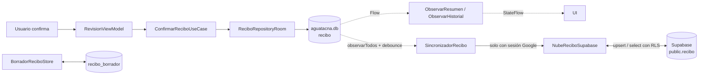
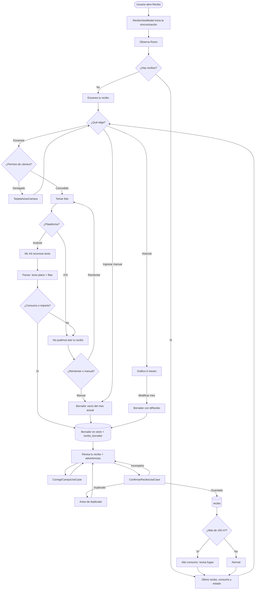
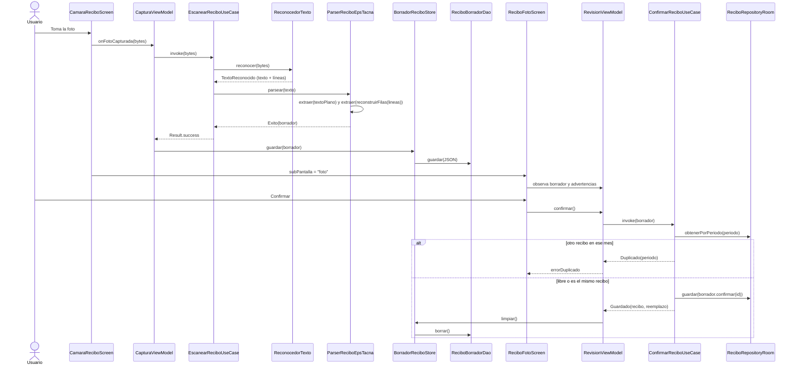
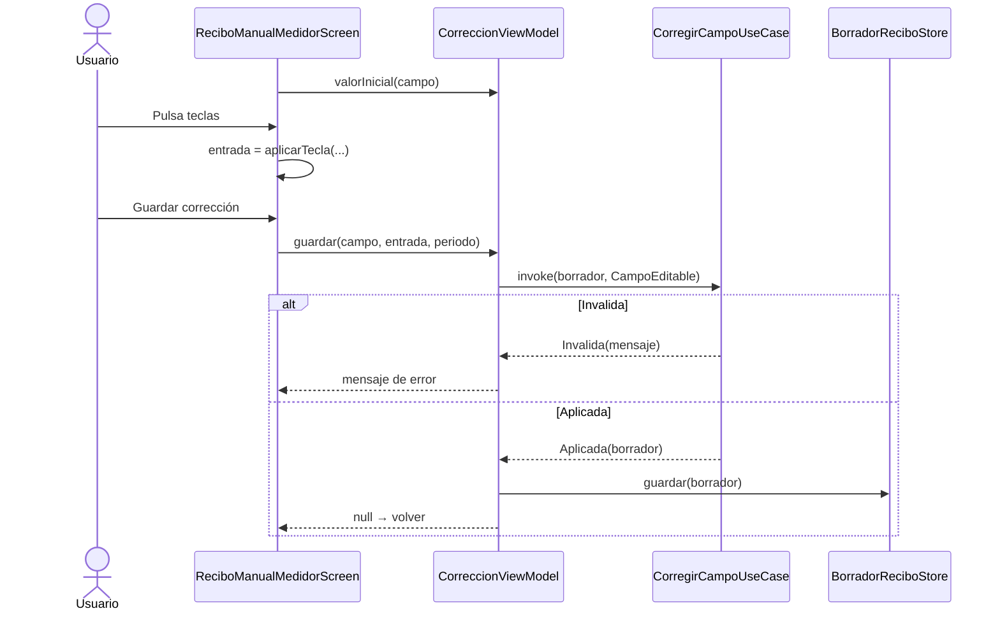
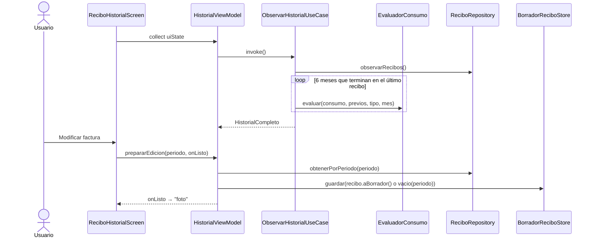
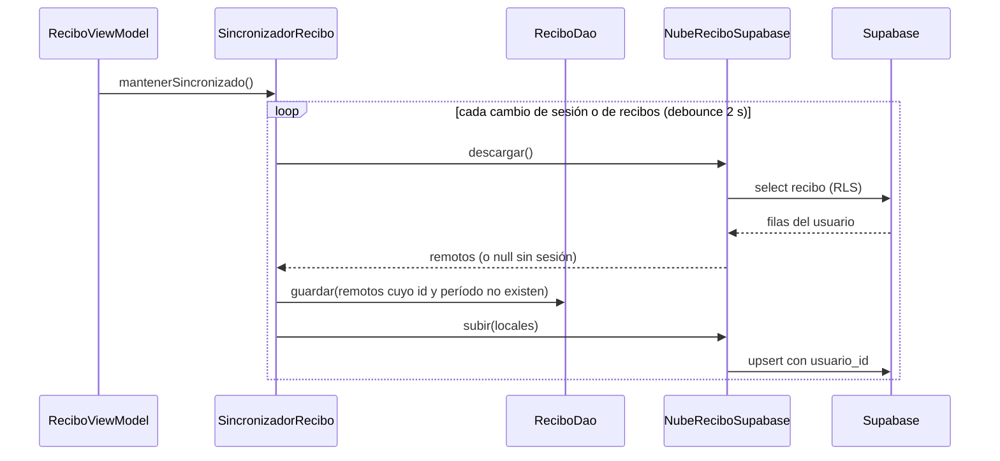
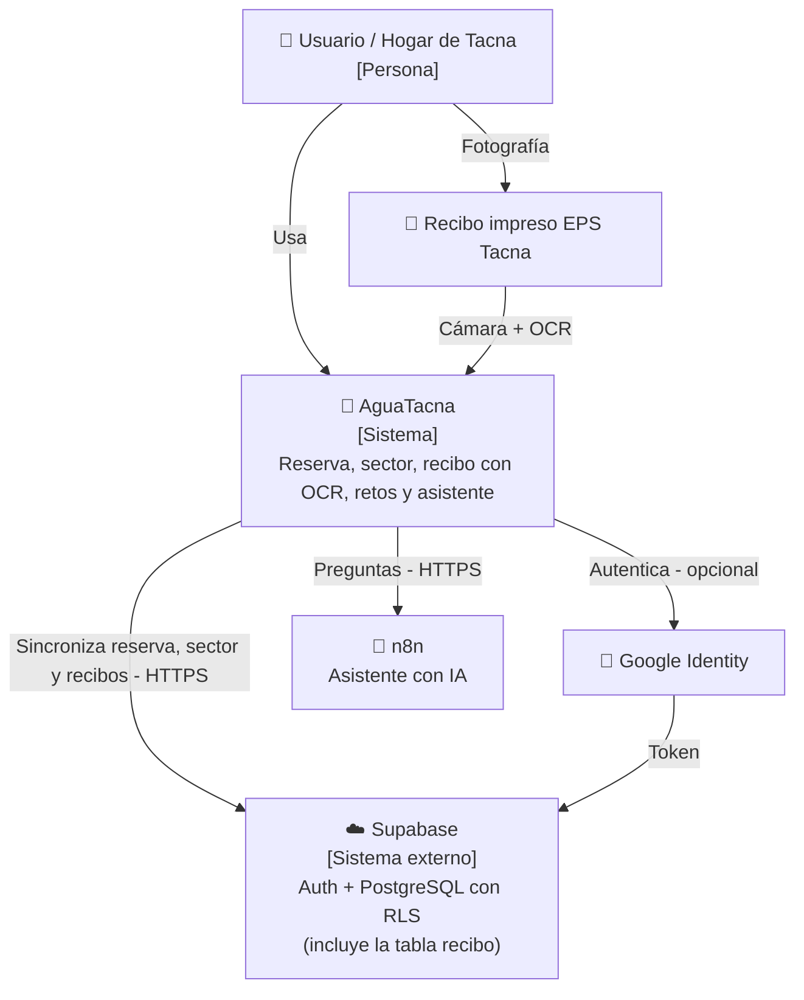
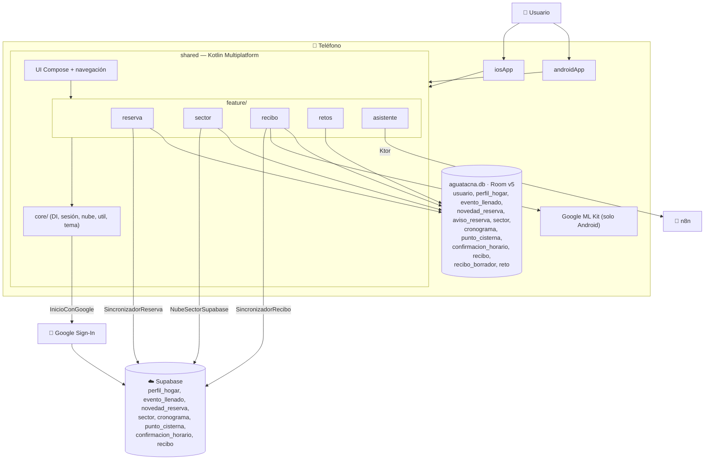
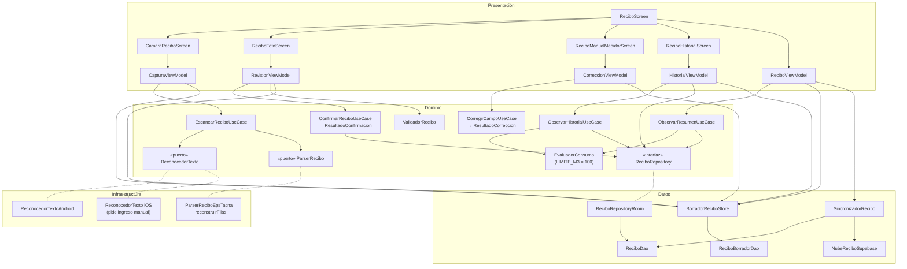
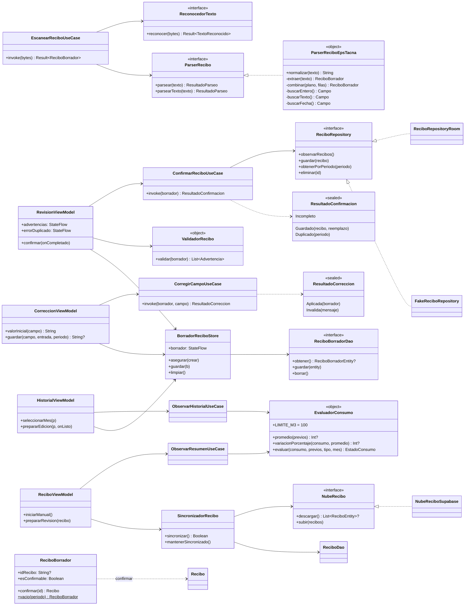

# Informe técnico — Módulo **Recibo** de AguaTacna

> Estado del módulo después de la rama `fix/recibo-observaciones` (29/09/2026).
> Ruta del módulo: `shared/src/commonMain/kotlin/pe/edu/upt/aguatacna/feature/recibo/`
> Responsable del módulo: Iker Alberto Sierra Ruiz

---

## 1. Resumen en una frase

El módulo Recibo permite **fotografiar el recibo de agua de EPS Tacna**, convertir la foto en datos con **OCR local (Google ML Kit en Android)**, que el usuario **revise y corrija** los campos, **guardarlo en Room / SQLite** (y, si entró con Google, **copiarlo a Supabase**) y ver un **historial de 6 meses** que marca como **Alto consumo** cualquier mes con **más de 100 m³**, con un mensaje corto para revisar fugas en casa.

---

## 2. ¿Cuántos archivos tiene?

Todos los conteos salen de `find`, `wc -l` y `grep` sobre el código (no son estimados).

### 2.1 Carpeta del módulo (`commonMain/.../feature/recibo`)

| Métrica | Valor |
|---|---|
| Archivos totales | **44** |
| Archivos Kotlin (`.kt`) | **42** |
| Archivos `.gitkeep` | 2 (`data/`, `domain/`) |
| Líneas Kotlin (con imports y líneas en blanco) | **4 628** |

### 2.2 Archivos del módulo en otros source sets

| Source set | Archivos | Líneas | Para qué |
|---|---|---|---|
| `androidMain` | `ReconocedorTextoAndroid.kt`, `ReconocedorTextoPlataforma.android.kt` | 65 | OCR con ML Kit y su `actual` |
| `iosMain` | `ReconocedorTextoPlataforma.ios.kt` | 19 | `actual` que pide el ingreso manual |
| `commonTest` | 12 archivos | 1 074 | **67** pruebas `@Test` |
| `androidHostTest` | 4 archivos (`ReciboRepositoryRoomTest`, `SincronizadorReciboTest`, `BorradorReciboStoreTest`, `FakeReciboDao`) | 335 | **12** pruebas `@Test` |

### 2.3 Detalle por capa (carpeta principal)

| Capa | Archivo | Líneas | `fun` |
|---|---|---|---|
| **di** | `ReciboModule.kt` | 44 | 0 |
| **domain/model** | `Dinero.kt` | 56 | 8 |
| | `ModelosSoporte.kt` (Campo, OrigenDatos, TipoConsumo, EstadoConsumo, LineaTexto, TextoReconocido) | 120 | 4 |
| | `PeriodoConsumo.kt` | 102 | 5 |
| | `Recibo.kt` | 36 | 1 |
| | `ReciboBorrador.kt` | 58 | 2 |
| **domain/port** | `ParserRecibo.kt` | 16 | 2 |
| | `ReconocedorTexto.kt` | 8 | 1 |
| **domain/repository** | `ReciboRepository.kt` | 21 | 4 |
| **domain/service** | `EvaluadorConsumo.kt` | 38 | 3 |
| | `ValidadorRecibo.kt` | 43 | 1 |
| **domain/usecase** | `ConfirmarReciboUseCase.kt` | 39 | 2 |
| | `CorregirCampoUseCase.kt` | 70 | 2 |
| | `EscanearReciboUseCase.kt` | 36 | 1 |
| | `ObservarHistorialUseCase.kt` | 74 | 3 |
| | `ObservarResumenUseCase.kt` | 43 | 1 |
| **data** | `BorradorReciboStore.kt` | 51 | 3 |
| | `FakeReciboRepository.kt` | 38 | 5 |
| | `ReciboRepositoryRoom.kt` | 33 | 4 |
| **data/local** | `ReciboDao.kt` | 23 | 4 |
| | `ReciboEntity.kt` | 60 | 2 |
| | `ReciboBorradorDao.kt` | 19 | 3 |
| | `ReciboBorradorEntity.kt` | 98 | 6 |
| **data/sync** | `SincronizadorRecibo.kt` (+ interfaz `NubeRecibo`) | 62 | 5 |
| | `NubeReciboSupabase.kt` | 52 | 4 |
| **infrastructure/ocr** | `ParserReciboEpsTacna.kt` | 127 | 12 |
| | `ReconstructorFilas.kt` | 24 | 2 |
| | `ReconocedorTextoPlataforma.kt` (`expect`) | 6 | 1 |
| **presentation** (ViewModels) | `ReciboViewModel.kt` | 91 | 4 |
| | `CapturaViewModel.kt` | 92 | 6 |
| | `RevisionViewModel.kt` | 70 | 3 |
| | `HistorialViewModel.kt` | 66 | 3 |
| | `CorreccionViewModel.kt` (+ `aplicarTecla`) | 85 | 6 |
| **presentation** (Pantallas) | `ReciboScreen.kt` | 214 | 3 |
| | `CamaraReciboScreen.kt` | 329 | 8 |
| | `ReciboFotoScreen.kt` | 138 | 3 |
| | `ReciboManualMedidorScreen.kt` | 124 | 2 |
| | `ReciboHistorialScreen.kt` | 97 | 1 |
| **presentation/componentes** | `ReciboGeneralComponentes.kt` | 751 | 9 |
| | `ReciboFotoComponentes.kt` | 419 | 7 |
| | `ReciboHistorialComponentes.kt` | 397 | 4 |
| | `ReciboManualComponentes.kt` | 358 | 4 |

---

## 3. ¿Cuántas funciones tiene?

| Tipo | Cantidad |
|---|---|
| Declaraciones `fun` en la carpeta principal | **154** |
| + `androidMain` (`reconocer`, `crearReconocedorTexto`) | 2 |
| + `iosMain` (`crearReconocedorTexto`, `reconocer`) | 2 |
| **Total del módulo** | **158** |
| De ellas, funciones `@Composable` | 39 |
| De ellas, firmas abstractas (DAO, puertos, repositorio, `NubeRecibo`) + 1 `expect` | 17 |

Clases principales: 5 casos de uso, 2 servicios de dominio, 5 ViewModels, 5 pantallas, 4 interfaces (2 puertos, repositorio, `NubeRecibo`), 2 DAO, 2 entidades Room, 1 sincronizador.

---

## 4. Funciones del módulo y cómo se llaman

### 4.1 La función de OCR (foto → información)

| Paso | Clase · función | Qué hace |
|---|---|---|
| 1 | `EscanearReciboUseCase.invoke(bytesImagen)` | Caso de uso "OCR". Recibe los bytes y devuelve `Result<ReciboBorrador>`. Recibe el reconocedor y el parser por constructor (sin valores por defecto). |
| 2 | `ReconocedorTexto.reconocer(bytes)` | Android: `ReconocedorTextoAndroid` (ML Kit, en el teléfono). iOS: falla con "En iOS aún no se puede leer el recibo con la cámara. Ingresa los datos a mano." Se elige con `expect fun crearReconocedorTexto()`. |
| 3 | `ParserReciboEpsTacna.parsear(texto)` | Lee **dos veces**: el `textoPlano` de ML Kit y el texto rearmado por filas con `reconstruirFilas(lineas)`. Por cada campo manda el texto plano, salvo que las filas den un valor que falta o más confiable. |

`reconstruirFilas` ordena las líneas por su centro vertical, junta en una fila las que están a menos de medio alto de línea, las ordena por `x` y las une con dos espacios. Así "PROMEDIO m³" y "23", que ML Kit devuelve en bloques distintos, quedan como `PROMEDIO M³  23`.

Reglas del consumo (en este orden): **Volumen Fac m³** (0.95) → **PROMEDIO m³** (0.90, exige la `M` de la unidad para no confundirse con "Tipo Consumo: PROMEDIO" ni con "MEDIDOR") → **CONSUMO FACTURADO** (0.75). Aceptan que el "³" salga como `²`, `ª`, `°`, `'`.

Helpers privados: `buscar`, `buscarEntero`, `buscarTexto`, `buscarFecha`, `campo`, `elegir`, `combinar`, `extraer`, `parsearFecha`, más `normalizar` (pública).

### 4.2 Casos de uso (domain/usecase)

| Caso de uso | Función | Qué hace |
|---|---|---|
| `EscanearReciboUseCase` | `invoke(ByteArray)` | Foto → OCR → Parser → `ReciboBorrador` |
| `CorregirCampoUseCase` | `invoke(borrador, CampoEditable): ResultadoCorreccion` | Valida y corrige: consumo 0–999; lecturas ≥ 0 con anterior ≤ actual; importe > 0 y ≤ S/ 99 999. Devuelve `Aplicada(borrador)` o `Invalida(mensaje)` |
| `ConfirmarReciboUseCase` | `invoke(borrador): ResultadoConfirmacion` | `Incompleto` si faltan período, consumo o importe; `Duplicado(periodo)` si otro recibo ocupa ese mes; si no, guarda y devuelve `Guardado(recibo, reemplazo)` |
| `ObservarResumenUseCase` | `invoke(): Flow<ResumenRecibo?>` | Recibo más reciente + estado con `EvaluadorConsumo` |
| `ObservarHistorialUseCase` | `invoke(): Flow<HistorialCompleto?>` | Los 6 meses que **terminan en el recibo más reciente**, cada uno evaluado con `EvaluadorConsumo` |

### 4.3 Servicios de dominio

| Servicio | Funciones | Regla |
|---|---|---|
| `EvaluadorConsumo` | `evaluar`, `promedio`, `variacionPorcentaje` | **Única regla**: `consumo > LIMITE_M3 (100)` → `ALTO_CONSUMO`; si no → `NORMAL`. El promedio (hasta 6 meses) y la variación solo se muestran en el detalle del último mes |
| `ValidadorRecibo` | `validar(borrador)` | Advertencias no bloqueantes con los datos que haya: consumo 0–999, vencimiento ≥ emisión, lecturas coherentes con el consumo. Se muestran en "Revisa tu recibo" |

### 4.4 Modelos (value objects)

| Modelo | Funciones destacadas |
|---|---|
| `Dinero` (céntimos `Long`) | `formatear()` → "S/ 74,20", `parsear("78,29")` (redondea), `desdeSoles`, `plus`, `minus` |
| `PeriodoConsumo` | `parsear("AGOSTO-2026")`, `de(fecha)`, `anterior()`, `siguiente()`, `mesCorto` ("Set"), `mesLargo`, `displayCompleto` |
| `Campo<T>` | `esDudoso` (< 0.7), `corregir(valor)`, `Campo.confirmado(valor)` |
| `ReciboBorrador` | `idRecibo`, `esConfirmable` (período + consumo + importe), `tieneCamposDudosos`, `confirmar(id)` (lo que falta queda en `null`), `ReciboBorrador.vacio(periodo)` |
| `Recibo` | `aBorrador()` (lleva el `id` para poder editarlo) |
| `EstadoConsumo` | `ALTO_CONSUMO` (chip "Alto consumo") o `NORMAL` (chip "Normal") |
| `PeriodoConsumo.vencimiento()` | Día 11 del mes siguiente al consumo (setiembre → 11 de octubre); es lo que muestra la pantalla principal |

### 4.5 Datos

| Clase | Funciones |
|---|---|
| `ReciboRepository` (interfaz) | `observarRecibos()`, `guardar()`, `obtenerPorPeriodo()`, `eliminar()` |
| `ReciboRepositoryRoom` | Room; al guardar reutiliza el id del recibo que ya ocupa el período |
| `FakeReciboRepository` | En memoria; imita a Room (mismo id por período, nunca dos filas con el mismo id) |
| `ReciboDao` / `ReciboEntity` | Tabla `recibo` |
| `ReciboBorradorDao` / `ReciboBorradorEntity` | Tabla `recibo_borrador`: una fila (`id = 1`) con el borrador en JSON (`BorradorGuardado`) |
| `BorradorReciboStore` | `borrador`, `guardar`, `limpiar`, `asegurar(crear)`; con DAO se restaura al abrir y se copia a Room en cada cambio |
| `SincronizadorRecibo` | `sincronizar()`, `mantenerSincronizado()` |
| `NubeReciboSupabase` | `descargar()` (null sin sesión), `subir()` (upsert con `usuario_id`) |

### 4.6 ViewModels

| ViewModel | Funciones | Estado |
|---|---|---|
| `ReciboViewModel` | `iniciarManual()`, `prepararRevision(recibo)`; en `init` lanza `mantenerSincronizado()` | `ReciboUiState` |
| `CapturaViewModel` | `onFotoCapturada`, `iniciarManual()`, `reiniciar()` | `CapturaUiState` |
| `RevisionViewModel` | `confirmar(onCompletado)`, `descartarError()`; asegura un borrador del mes actual | `borrador`, `advertencias`, `errorDuplicado` |
| `HistorialViewModel` | `seleccionarMes`, `prepararEdicion(periodo, onListo)` | `HistorialUiState` |
| `CorreccionViewModel` | `valorInicial(campo)`, `periodoInicial()`, `guardar(campo, entrada, periodo): String?` | `borrador`, `periodoActual` |

`aplicarTecla(entrada, tecla, permiteComa, maxDigitos)` es una función pura para el teclado en pantalla. Todos los ViewModels obtienen la fecha del `Reloj` inyectado por Koin.

### 4.7 Pantallas y componentes

| Pantalla | Qué muestra |
|---|---|
| `ReciboScreen` | Enrutador interno (`subPantalla`): `principal`, `camara`, `foto`, `manualMedidor`, `historial`. Ya no usa `KoinPlatform` ni corrutinas: delega en los ViewModels |
| `CamaraReciboScreen` | Cámara, "Leyendo recibo…", errores y permisos con una sola `TarjetaAvisoCamara` |
| `ReciboFotoScreen` | "Revisa tu recibo": `ChipRevision`, avisos (`AvisoRevision`) de duplicado y advertencias, campos y Confirmar |
| `ReciboManualMedidorScreen` | Teclado estilo medidor o selector de mes; solo maneja teclas y muestra el error |
| `ReciboHistorialScreen` | Gráfico de 6 meses con la línea en `EvaluadorConsumo.LIMITE_M3`, alerta corta y detalle del mes |

---

## 5. Requerimientos

### 5.1 Requerimientos funcionales

| ID | Requerimiento | Dónde se implementa |
|---|---|---|
| RF-01 | Capturar una foto del recibo pidiendo el permiso de cámara | `CamaraReciboScreen`, `core/util/capturaFoto` |
| RF-02 | Reconocer el texto de la foto con OCR local (Android) | `ReconocedorTextoAndroid` |
| RF-03 | En iOS, avisar que el OCR no está disponible y ofrecer el ingreso manual | `ReconocedorTextoPlataforma.ios.kt` + pantalla de error |
| RF-04 | Extraer período, consumo m³ (Volumen Fac o PROMEDIO m³), importe, tipo, fechas, lecturas, medidor y N.º de recibo, aunque etiquetas y valores salgan en bloques distintos | `ParserReciboEpsTacna`, `reconstruirFilas` |
| RF-05 | Indicar la confianza y resaltar los datos dudosos (< 70 %) | `Campo.esDudoso`, `ChipRevision` |
| RF-06 | Mostrar advertencias de coherencia sin bloquear la confirmación | `ValidadorRecibo.validar(borrador)`, `AvisoRevision` |
| RF-07 | Ingresar un recibo a mano con el mes actual | `ReciboBorrador.vacio`, `iniciarManual()` |
| RF-08 | Corregir consumo, lecturas, importe y período con validación | `CorregirCampoUseCase`, `CorreccionViewModel` |
| RF-09 | Confirmar con período + consumo + importe | `ConfirmarReciboUseCase` |
| RF-10 | Impedir dos recibos del mismo mes, pero permitir **modificar** uno existente o moverlo de mes | `ResultadoConfirmacion.Duplicado`, `idRecibo` |
| RF-11 | Resumen del último recibo: importe, vencimiento (11 del mes siguiente) y consumo | `ObservarResumenUseCase` |
| RF-12 | Marcar **Alto consumo** cuando un mes supera 100 m³, con un mensaje corto | `EvaluadorConsumo`, `EstadoConsumo.ALTO_CONSUMO` |
| RF-13 | Historial de los 6 meses que terminan en el último recibo; elegir un mes y modificarlo | `ObservarHistorialUseCase`, `HistorialViewModel` |
| RF-14 | Conservar el borrador si el sistema cierra la app durante la revisión | `BorradorReciboStore` + `recibo_borrador` |
| RF-15 | Con cuenta de Google, copiar los recibos a la nube y recuperarlos en otro teléfono | `SincronizadorRecibo`, `NubeReciboSupabase` |

### 5.2 Requerimientos no funcionales

| ID | Requerimiento | Evidencia |
|---|---|---|
| RNF-01 | **Privacidad**: la foto nunca se guarda | `CapturaViewModel.liberarFoto()` |
| RNF-02 | **Privacidad**: sin nombre, DNI ni dirección en Room ni en Supabase; RLS "cada usuario lo suyo" | `ReciboEntity`, `BorradorGuardado`, migración `20260929_recibo_tabla_inicial.sql` |
| RNF-03 | **Sin conexión como base**: Room es la fuente de verdad; la nube solo copia | `SincronizadorRecibo` (errores de red → `false`) |
| RNF-04 | **Exactitud monetaria**: céntimos `Long`, redondeo al escribir el importe | `Dinero.parsear` |
| RNF-05 | **Dominio puro**: `domain/` solo usa Kotlin estándar, corrutinas y kotlinx-datetime | `EscanearReciboUseCase` ya no importa infraestructura |
| RNF-06 | **El ViewModel orquesta, no calcula**; los composables solo dibujan | Estado y variación en `EvaluadorConsumo`; validaciones en `CorregirCampoUseCase` |
| RNF-07 | **UI reactiva** | `Flow` + `StateFlow` |
| RNF-08 | **Multiplataforma** con `expect/actual` | `crearReconocedorTexto()` |
| RNF-09 | **OCR fuera del hilo principal** | `withContext(Dispatchers.Default)` |
| RNF-10 | **Usabilidad**: español, "S/ 74,20", "Set" | `Dinero`, `PeriodoConsumo` |
| RNF-11 | **Pruebas**: 79 pruebas del módulo | `commonTest` (67) + `androidHostTest` (12) |
| RNF-12 | **Esquema versionado**: Room v5 con `AutoMigration(4, 5)` y `schemas/.../5.json` | `AguaTacnaDatabase` |

---

## 6. Arquitectura que utiliza

**Clean Architecture + MVVM + DDD táctico + Puertos y Adaptadores**, en Kotlin Multiplatform.

```
feature/recibo/
├── presentation/   Pantallas Compose + 5 ViewModels + UiState sellado
├── domain/         Núcleo puro
│   ├── model/        Recibo, ReciboBorrador, Dinero, PeriodoConsumo, Campo, EstadoConsumo…
│   ├── service/      EvaluadorConsumo (regla de 100 m³), ValidadorRecibo
│   ├── usecase/      Escanear, Corregir, Confirmar, ObservarResumen, ObservarHistorial
│   ├── port/         ReconocedorTexto, ParserRecibo
│   └── repository/   ReciboRepository
├── data/           Room (recibo, recibo_borrador), Fake, Store, sync/ (Supabase)
├── infrastructure/ ParserReciboEpsTacna, reconstruirFilas, expect crearReconocedorTexto
└── di/             Koin: moduloRecibo
```

| Tecnología | Uso en Recibo |
|---|---|
| Kotlin 2.4 · Compose Multiplatform | Lenguaje y UI |
| Koin | `moduloRecibo` (parser, reconocedor, store, sincronizador, casos de uso) |
| Room KMP | Tablas `recibo` y `recibo_borrador` en `aguatacna.db` |
| Supabase (Auth + PostgREST) | Tabla `recibo` con RLS |
| kotlinx.serialization | Borrador en JSON y DTO `ReciboNube` |
| Google ML Kit | OCR en Android |
| FileKit · moko-permissions | Cámara y permiso |

---

## 7. ¿Cómo se guardan los datos? (con cuenta / sin cuenta)

### 7.1 Base de datos local

- **SQLite** con **Room**, archivo `aguatacna.db`, `core/db/AguaTacnaDatabase` **versión 5**.
- Recibo es dueño de dos tablas:
  - `recibo`: los recibos confirmados (id, anio, mes, consumoM3, importeCentimos, fechas, tipoConsumo, lecturas, numeroMedidor, numeroRecibo, origen).
  - `recibo_borrador`: una sola fila `id = 1` con el borrador en revisión como JSON.

### 7.2 Proceso de guardado

1. El OCR, el ingreso manual o "Modificar" dejan un `ReciboBorrador` en `BorradorReciboStore`, que lo copia a `recibo_borrador`.
2. Las correcciones pasan por `CorregirCampoUseCase`.
3. Al pulsar **Confirmar**, `RevisionViewModel` llama a `ConfirmarReciboUseCase(borrador)`:
   - `Incompleto` si falta período, consumo o importe;
   - `Duplicado` si otro recibo (con otro id) ocupa ese mes;
   - si no, guarda con `idRecibo` (edición) o con un id nuevo `recibo-<uuid>`.
4. `ReciboRepositoryRoom.guardar()` hace upsert.
5. Room emite; resumen e historial se recalculan solos.
6. Se limpia el borrador (también de `recibo_borrador`).

### 7.3 Con cuenta (Google) y sin cuenta

| | **SIN_CUENTA** | **GOOGLE** |
|---|---|---|
| Dónde se guarda | Tabla `recibo` del teléfono | Tabla `recibo` del teléfono **y** tabla `public.recibo` de Supabase |
| Cuándo se sincroniza | Nunca | Al abrir la pestaña Recibo, al iniciar sesión y 2 s después de cada cambio (`debounce`) |
| Qué baja de la nube | — | Recibos cuyo `id` **y** período no existen en el teléfono |
| Qué sube | — | Todos los recibos del teléfono (upsert; en un conflicto gana el teléfono) |
| Borrados | — | No se propagan (esta versión solo suma) |
| Cambio de teléfono | Se pierden los recibos | Se restauran al entrar con la misma cuenta |
| Sin red | — | `sincronizar()` devuelve `false` y se reintenta con el próximo cambio |

La tabla de Supabase usa la clave `(usuario_id, id)`, no el período, para que al mover un recibo de mes se actualice la misma fila.



---

## 8. Flujo del módulo

```
principal ──Escanear──────────► camara ──OCR ok──► foto (revisión) ──Confirmar──► principal
    │                             │                    │  ▲
    │                             └─Error / Manual─► manualMedidor
    ├──Ingresar manual──► foto                        │  │
    ├──Revisar lectura──► foto          manualMedidor (corregir campo)
    └──Ver historial────► historial ──Modificar mes──► foto
```

Al tocar el ícono **Recibo** de la barra inferior desde una sub-pantalla, `resetTrigger` vuelve a `principal`.

---

## 9. Diagrama de flujo



---

## 10. Diagramas de secuencia

### 10.1 Escanear y confirmar



### 10.2 Corrección manual de un campo



### 10.3 Ver historial y modificar un mes



### 10.4 Sincronización con la cuenta



---

## 11. Diagramas C4

> **C1 y C2** muestran toda la aplicación. **C3 y C4** solo el módulo Recibo.

### 11.1 C1 — Contexto del sistema



### 11.2 C2 — Contenedores



### 11.3 C3 — Componentes (módulo Recibo)



### 11.4 C4 — Código (módulo Recibo)



---

## 12. Observaciones

### 12.1 Observaciones del informe anterior

| # | Observación | Estado |
|---|---|---|
| 1 | "Modificar" un recibo no se podía guardar | ✅ Corregida: `idRecibo` + `ResultadoConfirmacion` en el dominio |
| 2 | El dominio dependía de la infraestructura | ✅ Corregida: el parser se inyecta por Koin |
| 3 | Dos criterios de "Alto consumo" | ✅ Corregida: una sola regla (> 100 m³); se eliminó todo lo de reclamos ante Sunass |
| 4 | Valores escritos a mano (agosto 2026, medidor 0412887, fechas inventadas) | ✅ Corregida: `ReciboBorrador.vacio`, `PeriodoConsumo.de` y `Reloj` inyectado |
| 5 | `ValidadorRecibo` y `SemillaDepuracion` sin uso | ✅ Corregida: advertencias en la revisión; la semilla pasó a `commonTest/SemillaRecibos.kt` |
| 6 | Sin OCR en iOS | ✅ Corregida: `expect/actual`; iOS pide el ingreso manual |
| 7 | Sin sincronización con cuenta | ✅ Corregida: `SincronizadorRecibo` + tabla `recibo` en Supabase (falta aplicar la migración) |
| 8 | Archivos de más de 150 líneas | ⏳ **Pendiente** (fuera de alcance). Hoy: `ReciboGeneralComponentes` 751, `ReciboFotoComponentes` 419, `ReciboHistorialComponentes` 397, `ReciboManualComponentes` 358, `CamaraReciboScreen` 329, `ReciboScreen` 214 (líneas totales, con imports) |
| 9 | Lógica en la UI | ✅ Corregida: `CorreccionViewModel`, `aplicarTecla`, validaciones en `CorregirCampoUseCase`; sin `KoinPlatform` en las pantallas |
| 10 | El borrador vivía solo en memoria | ✅ Corregida: tabla `recibo_borrador` (Room v5) |

También se corrigieron: el importe escrito se truncaba (78,29 → 78,28); la ventana del historial podía empezar en el recibo más antiguo e incluir meses futuros vacíos; el OCR no leía el consumo cuando etiquetas y valores venían en bloques distintos.

### 12.2 Observaciones nuevas

1. **`InyeccionTest` falla fuera de Recibo**: el módulo de prueba no registra `SectorDao`, que ahora necesita `AbastecimientosDelSector` por el cambio de Sector. Las 2 pruebas de ese archivo fallan; no tocan Recibo.
2. **La sincronización empieza al abrir la pestaña Recibo**, porque vive en `ReciboViewModel` (así se evitó tocar `MainActivity`). En un teléfono nuevo, los recibos se restauran la primera vez que se entra a Recibo.
3. **Los borrados no se propagan** a la nube (igual que Reserva). Si más adelante se agrega "eliminar recibo", habrá que decidir cómo sincronizarlo.
4. **iOS todavía no arranca Koin**: `iosMain` no llama a `iniciarKoin` ni registra los DAO, así que en iOS las pantallas de Recibo que piden sus ViewModels a Koin aún no pueden abrirse (cuando se arranque, el borrador quedará en memoria hasta registrar `reciboBorradorDao`). Además `crearBaseDeDatos()` de iOS usa `fallbackToDestructiveMigration`, que la constitución (art. VI) prohíbe fuera del entorno local. Es código del core.
5. **`ReciboEntity` conserva valores por defecto de columna** (`anio = 2026`, `mes = 1`) que vienen de migraciones anteriores; no se usan desde el código, pero quitarlos cambiaría el esquema.
